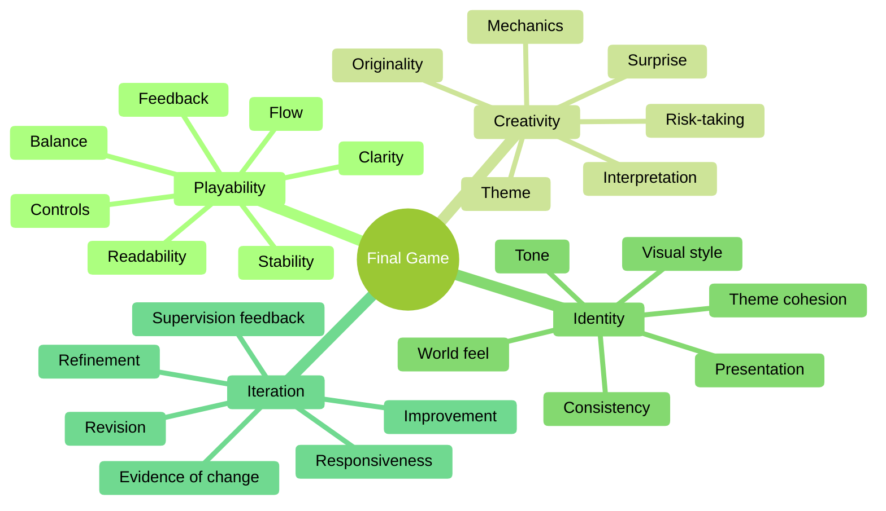

**Programme**
:   BSc (Hons) in Computing in Games Development

**Stage**
:   4

**Module**
:   3D Game Development

**Title**
:   GCA-2 - Group Game Delivery

**Weight**
:   25%

**Shared With**
:   Collaborative Project

**Due Date**
:   See Moodle

**Late Submission**
:   Institute policy on late submission will apply (see
    [here](https://www.dkit.ie/about/policies/continuous-assessment-procedures))

**Academic Integrity**
:   Institute policy on academic integrity will apply (see
    [here](https://www.dkit.ie/about/policies/academic-integrity-policy-and-procedures))

**Generative AI Tools**
:   Institute policy on the use of Generative AI tools will apply (see
    [here](https://www.dkit.ie/about/policies/generative-artificial-intelligence-ai-and-your-assessments-a-guide-for-students))

**CA Cover Sheet**
:   A signed CA cover sheet must be included and may be found (see
    [here](https://www.dkit.ie/about/policies/continuous-assessment-procedures))

## Overview

This Group Continuous Assessment evaluates the quality of your team’s final game as delivered for the end of the project. The assessment focuses on the extent to which the group has produced a playable, creative, and coherent game, and the extent to which the final version shows meaningful iteration in response to supervision.

This assessment is not intended to reward technical complexity for its own sake. A smaller, clearer, better-judged game will score more highly than a larger but confused, unstable, or weakly resolved one.

The judgement in this assessment is made through the final playable build, the team presentation, and the supporting evidence presented in the team Mahara. The Mahara should not merely archive material. It should help the team make a concise and credible case for the quality of the final project.

## Assessment Criteria

This assessment focuses on **four** qualities:

| Criterion| Definition |
| :-|:-|
| **Playability** | Whether the game is clear, stable, and workable as a player experience.                                              |
| **Creativity**  | Whether the game shows thoughtful or distinctive ideas in its design, mechanics, presentation, or player experience. |
| **Identity**    | Whether the game communicates a clear overall character through its style, tone, gameplay, and presentation.         |
| **Iteration**   | Whether the team has acted on supervisory feedback in a meaningful way to improve the final product.                 |

The diagram below is intended to help you think about the language of the rubric. It is not a checklist and it does not create additional marking criteria. Instead, it gives you useful terms that may help you explain and evidence the strengths of your game in the build, the presentation, and the team Mahara.

## Team Mahara Defence Questions

Your team Mahara must include a short written response to each of the following four questions.

Each response must:

- be **no more than 200 words**;
- answer the question **honestly and directly**;
- stay grounded in the **final game that was actually submitted**;
- make a clear claim;
- support that claim with specific evidence from the project;
- refer, where appropriate, to material elsewhere in the Mahara such as screenshots, development evidence, build features, presentation material, or records of revision.

When answering these questions, do not make claims that are not visible in the final build, not evidenced elsewhere in the Mahara, or not supported by the team presentation. The purpose of the Mahara defence is not to describe what the team hoped to achieve, what was planned but unfinished, or what might have been possible with more time. Instead, it is to explain and justify the quality of the final game as it exists at submission. The strongest responses are grounded, specific, and self-aware. They explain what the team actually achieved, where the game is genuinely strong, and how the delivered work supports that judgement. Claims that exaggerate the quality, originality, clarity, or level of iteration in the submitted game may also be awarded limited credit if the evidence does not support them.

| Criterion | Required Mahara question |
| :- | :- |
| **Playability** | **How does your final game demonstrate playability?** Briefly explain how the team ensured the game is clear, stable, and workable for players, referring to specific features, design choices, or testing outcomes that are evident in the delivered build. |
| **Creativity** | **What is creative or distinctive about your game?** Briefly explain the most original or thoughtful ideas in your game’s concept, mechanics, presentation, or player experience, and why these choices strengthen the final project as delivered. |
| **Identity** | **How does your game communicate a clear identity?** Briefly explain how its style, tone, gameplay, and presentation work together to create a recognisable and coherent experience in the final submitted version. |
| **Iteration** | **How did supervisory feedback shape your final game?** Briefly explain the most important changes made in response to supervision, and how those changes improved the final delivered product. |

## Submission

Your submission for this assessment will be judged through the following:

- the final playable group build;
- the team Mahara evidence, including the four defence responses above.

This assessment rewards teams that deliver a game with a clear player experience, a recognisable identity, and visible improvement across supervision. It does not reward scale, feature count, or technical difficulty in isolation.

A strong submission will therefore do **three** things well:

- present a game that works;
- show that the game has a clear creative direction;
- demonstrate that the team improved the work in response to supervision.

## Appendix A: Assessment Rubric

The rubric below uses the standard grade-language bands used across the module. Judgement is made holistically within each criterion, but marks should remain grounded in the quality of the final delivered game, the team Mahara, and the presentation evidence.

| Component | **E (Excellent)** | **VG (Very Good)** | **G (Good)** | **S (Satisfactory)** | **P / NS (Pass / Not Satisfactory)** |
| :- | :- | :- | :- | :- | :- |
| **Playability (8)** | Highly playable, clear, stable, and polished. Progression, feedback, controls, and overall flow strongly support the player experience. | Playable and clear, with only minor issues in flow, stability, feedback, or readability. The intended player experience is communicated well. | Generally playable. Core gameplay works, though issues in clarity, balance, stability, or flow remain and reduce the overall quality of the experience. | Playable at a basic level, but notable issues in clarity, reliability, control, feedback, or progression affect the player experience. | Very difficult to play, unclear, unstable, or significantly broken. There is little meaningful success in delivering a workable player experience. |
| **Creativity (5)** | Distinctive and imaginative. The game demonstrates thoughtful or original ideas in its mechanics, concept, presentation, or player experience, and these choices clearly strengthen the final project. | Strong creative direction. The game contains clearly considered ideas that enhance the final project in meaningful ways. | A good level of creativity is evident. The game shows worthwhile ideas, though they may be familiar, conservative, or unevenly developed. | Limited creativity. Some attempt at originality is present, but ideas are weak, underdeveloped, inconsistent, or only marginally effective. | Very weak creativity. The work feels generic, derivative, or underdeveloped, with little meaningful evidence of original or thoughtful design choices. |
| **Identity (4)** | Strong, distinctive identity. Style, tone, gameplay, and presentation communicate a confident, coherent, and memorable overall character. | Clear and coherent identity. Style, tone, gameplay, and presentation work well together and give the game a recognisable character. | A recognisable identity is present, though it is not fully consistent, refined, or convincingly sustained across the experience. | Limited identity. Some sense of direction exists, but it is weak, uneven, or inconsistently expressed through the game. | Very weak identity. There is little clear sense of style, tone, or overall character, and the game feels generic, mixed, or unfocused. |
| **Iteration (8)** | Supervisory feedback was responded to thoughtfully and substantially. Revisions are well judged, clearly evidenced, and materially strengthen the final delivered game. | Clear evidence that supervisory feedback was acted upon effectively and that resulting revisions improved the final delivered game in meaningful ways. | Good evidence that supervisory feedback informed development and improvement, though the quality, depth, or clarity of revision may be uneven. | Limited evidence of response to supervisory feedback. Changes are basic, weakly evidenced, superficial, or only partly successful. | Little or no convincing evidence that supervisory feedback informed development. Revisions are absent, negligible, poorly evidenced, or disconnected from issues raised during supervision. |

## Appendix B: Glossary

The glossary below defines the helpful terms shown in the mindmap. These definitions are provided to support understanding of the rubric language. They are not additional marking criteria. You are not expected to address every term individually. Instead, use them to think more clearly about the strengths and weaknesses of your final game.

### Playability Terms

| Term | Definition |
| :- | :- |
| **Clarity** | The extent to which the player can understand what the game is asking them to do, what actions are possible, and what the immediate goals are. |
| **Feedback** | The information the game gives the player in response to their actions. This may be visual, audio, animation-based, or systemic, and should help the player understand what has happened. |
| **Controls** | How responsive, learnable, and dependable the player input feels during play. Good controls help the player feel that the game behaves as expected. |
| **Balance** | The extent to which challenge, difficulty, pacing, and player capability feel appropriately judged for the intended experience. |
| **Stability** | The degree to which the game runs reliably without crashes, serious bugs, broken progression, or unpredictable behaviour. |
| **Flow** | The smoothness with which the player moves through the game experience, including pacing, progression, and the relationship between challenge, action, and understanding. |
| **Readability** | How easily the player can interpret the game space, important objects, hazards, interactable elements, and the consequences of actions. |

### Creativity Terms

| Term | Definition |
| :- | :- |
| **Originality** | The presence of ideas, combinations, or interpretations that do not feel generic, copied, or overly predictable. |
| **Mechanics** | The systems and actions through which the player engages with the game. Creative mechanics often create interesting decisions, interactions, or patterns of play. |
| **Theme** | The central idea, subject, or imaginative frame that gives the game meaning or focus. |
| **Surprise** | Moments where the game does something unexpected, fresh, or engaging in a way that strengthens the experience. |
| **Risk-taking** | The willingness of the team to attempt ideas that are distinctive, interpretive, or unconventional, even within a constrained scope. |
| **Interpretation** | The way the team has translated an idea, genre, concept, or reference into a specific playable form of its own. |

### Identity Terms

| Term | Definition |
| :- | :- |
| **Visual style** | The overall look of the game, including colour, materials, lighting, composition, and graphical choices. |
| **Tone** | The emotional or expressive quality of the game, such as playful, eerie, tense, calm, absurd, or dramatic. |
| **Theme cohesion** | The extent to which the different parts of the game feel as though they belong to the same overall idea or direction. |
| **World feel** | The sense that the game world has a believable or intentional atmosphere, mood, and internal character. |
| **Presentation** | The way the game communicates itself to the player through menus, interface, visual framing, transitions, audio, and overall delivery. |
| **Consistency** | The degree to which the game maintains a stable style, tone, and design logic instead of feeling mixed, contradictory, or unfocused. |

### Iteration Terms

| Term | Definition |
| :- | :- |
| **Supervision feedback** | Guidance, critique, or direction provided during formal supervision, review, or mentoring discussions across the project. |
| **Revision** | A deliberate change made to the game in response to reflection, testing, or supervision. |
| **Refinement** | An improvement to something already present in the game so that it becomes clearer, stronger, more reliable, or more appropriate. |
| **Responsiveness** | The extent to which the team listened to, understood, and acted upon feedback rather than ignoring or misinterpreting it. |
| **Improvement** | A meaningful positive change in the quality of the game, such as greater clarity, better pacing, stronger usability, or a more coherent final experience. |
| **Evidence of change** | Visible proof that revisions actually happened, such as updated builds, screenshots, commit history, Mahara comparisons, or presentation evidence showing before-and-after development. |
