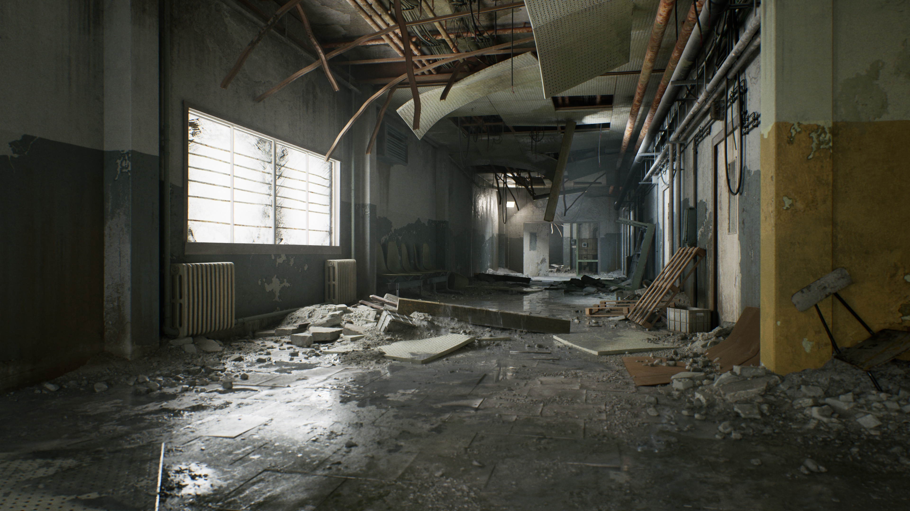
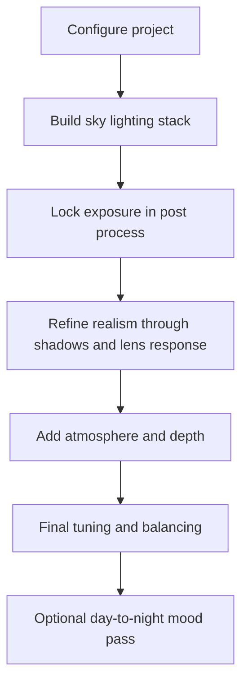

## Overview

This tutorial outlines a practical professional workflow for creating **hyper-realistic interior and exterior lighting** in **Unreal Engine 5** using the engine’s **default lighting system**. The goal is not simply to place a few lights, but to build a lighting setup that feels believable, cinematic, readable, and production-ready.

The workflow combines **Lumen**, physically motivated sky lighting, careful exposure control, post-processing, atmospheric depth, and subtle camera imperfections. Used properly, these help a scene move away from the flat, overly clean, synthetic look that often appears in inexperienced real-time work.

This topic directly supports the module’s focus on **rendering, lighting, shader use, post-processing, and atmosphere design** within 3D game production. In particular, it aligns strongly with the module emphasis on rendering and lighting practice, lighting theory, post-processing, ambient occlusion, volumetric light scattering, and production-level implementation in Unreal Engine. 

It also supports the current ICA emphasis on **environmental storytelling**, **storytelling through materials**, **playability**, and the use of lighting as part of a small but polished spatial experience. In a contained room-scale micro-experience, lighting is not decoration. It is one of the main tools used to guide the player, shape mood, reveal surfaces, and communicate world state. 

## Learning Goals

By the end of this tutorial you should be able to:

| You will learn to... | Why it matters |
| :- | :- |
| Configure Unreal Engine 5 for high-quality lighting work | Poor project configuration will limit visual quality before you even begin |
| Build a believable natural sky-lighting stack | Realistic scenes depend on layered lighting, not isolated light actors |
| Control exposure and bloom using Post Process Volume | Exposure discipline is essential for believable lighting judgement |
| Refine shadows, bounce feel, and lens response | Small adjustments often make the difference between gamey and convincing |
| Add atmosphere through clouds, fog, and volumetrics | Air and depth are part of lighting, not an afterthought |
| Tune final intensity, occlusion, and colour balance | Final grading is where realism and readability are stabilised |
| Adapt the workflow for both daylight and night mood | A strong workflow should support mood shifts without breaking plausibility |

## Before You Begin

For this lab, you should build your lighting pass on top of a space that already supports the semester ICA. Use **one** of the following starting points:

| Starting point | What to use it for | Why it is suitable |
| :- | :- | :- |
| **Your ICA greybox** | Best option if you already have a room, clue layout, and early puzzle space blocked in | It lets you develop lighting directly against the micro-experience you will refine for assessment |
| **A CubeGrid corridor or room study** | Good fallback if your ICA room is not yet ready | It gives you a fast controlled space for practising exposure, atmosphere, surface response, and focal lighting |

This aligns with the ICA requirement that the work remains a **single, contained environment** focused on **environmental storytelling**, **readability**, and **polish within a constrained scope** rather than scale or system complexity. 

This tutorial therefore assumes that your Unreal Engine 5 scene already contains at least basic architecture, surfaces, and scale references. Lighting should be developed against actual geometry and materials wherever possible. Empty prototype scenes are useful for testing, but realism is judged through how light interacts with form, roughness, colour, shadow, and atmosphere.

For best results, use a test space that contains a meaningful transition between zones, such as a room with windows, a doorway, a corridor opening into a chamber, or a partially enclosed exterior threshold. This makes it easier to evaluate exposure, bounce, shadow softness, volumetric effects, and readability across lighting zones.

### Suggested Lab Scope

Keep the spatial scope small. A short corridor leading to a puzzle door, a maintenance passage, a store room, a hospital side room, a security checkpoint, or a service tunnel is enough for this exercise. The goal is not to build more level. The goal is to make a **small amount of level look believable, readable, and atmospheric** in a way that supports the ICA brief. 

## Workflow Summary

Treat this lab as a **lighting and atmosphere pass**, not a level-building lab. Your main task is to take an existing ICA greybox or a simple CubeGrid corridor study and push it toward a more convincing final-art direction through light, fog, post-process control, and material response. Where possible, preserve the logic of the escape-room brief by ensuring that lighting helps support clue visibility, focal hierarchy, and state change readability. 

The overall workflow used in this tutorial is shown below.

## 1. Initial Project Configuration

Before placing or tuning lights, configure the project for high-end real-time rendering. A weak starting configuration makes later lighting decisions unreliable because reflections, bounce, softness, and image response will not behave as expected.

### 1.1 Enable Required Plugin

Open **Edit > Plugins** and enable the following:

| Plugin | Why it is needed |
| :- | :- |
| HDRI Backdrop | Useful for sky and environment-based lighting workflows, look development, and broader realism testing |

Restart the editor after enabling the plugin.

### 1.2 Check Project Rendering Features

Open **Project Settings** and search for the following systems:

| Setting / feature | Recommended action |
| :- | :- |
| Lumen | Enable |
| Mega Light | Enable |

These settings help ensure the project is using the intended modern lighting path rather than a weaker fallback.

### 1.3 Configure Lumen Reflection Quality

Under the project’s rendering settings, configure Lumen for higher-end reflection behaviour.

| Lumen option | Recommended value |
| :- | :- |
| Reflection mode | Hardware Ray Tracing |
| Reflection quality | 4 |

This improves the reliability of reflections and contributes to a more grounded material response, especially in glossy interiors, polished floors, glass-heavy spaces, and scenes with strong contrast between sunlight and shadow.

## 2. Build the Core Lighting Layers

A believable daylight scene usually begins with three foundational actors working together. Do not think of these as optional extras. Together they form the environmental light model for the world.

### 2.1 Add a Skylight

Add a **Skylight** actor to the scene.

The Skylight provides broad ambient contribution from the sky and environment. Without it, shadows often feel too empty and interiors can collapse into unnatural darkness. The Skylight is especially important when you want exterior light to influence indoor spaces in a more believable way.

### 2.2 Add a Directional Light

Add a **Directional Light** actor to act as the sun.

Position and rotate it so that it creates useful shadow shapes. Do not think only in terms of illumination strength. Think in terms of **shadow design**. Good lighting often comes from an interesting angle that creates depth on walls, floors, openings, props, and architectural features.

### 2.3 Add a Sky Atmosphere

Add a **Sky Atmosphere** actor.

This actor is essential for natural sky colour, sunlight scattering, and outdoor believability. Without it, daylight scenes often look sterile or overly artificial. It is one of the main reasons a UE5 sky setup begins to feel atmospheric rather than purely technical.

### 2.4 Core Actor Checklist

| Actor | Primary role | Common failure if missing |
| :- | :- | :- |
| Skylight | Ambient sky contribution | Shadows become too empty or interiors too dead |
| Directional Light | Main sunlight direction and shadow structure | Scene lacks clear form and time-of-day logic |
| Sky Atmosphere | Natural sky colour and light scattering | Exterior lighting feels flat or synthetic |

## 3. Set Up the Post Process Volume

The **Post Process Volume** is one of the most important actors in the scene. It is where you stabilise exposure, shape bloom, manage lens behaviour, and support the overall mood.

### 3.1 Add a Global Post Process Volume

Add a **Post Process Volume** and enable **Infinite Extent (Unbound)**.

This ensures the post-process settings affect the entire level rather than a small local zone. For general scene development and lighting look-dev, this is usually the most efficient starting point.

### 3.2 Lock the Exposure

Search within the Post Process Volume for **Auto Exposure** settings. Turn it on, then set:

| Setting | Value |
| :- | :- |
| Min Brightness | 1 |
| Max Brightness | 1 |

This effectively locks exposure so the scene does not constantly adapt in a way that hides lighting mistakes. Exposure drift can make a bad lighting setup appear acceptable because the camera is compensating for it. Locking exposure gives you more honest visual feedback and better manual control.

### 3.3 Enable and Control Bloom

Enable **Bloom** and switch the bloom method to the second option, commonly the more cinematic convolution-style approach. Then reduce the intensity until it looks subtle and plausible.

Bloom should support the image, not dominate it. If the effect is too strong, highlights become smeared and the scene begins to look stylised or cheap rather than realistic.

| Bloom principle | Good practice |
| :- | :- |
| Intensity | Keep restrained |
| Purpose | Support bright response, not flood the image |
| Common mistake | Overblown glow that destroys material readability |

## 4. Enhance Realism Through Detail Adjustments

Once the base lighting is functioning, refine the image using subtler adjustments that improve softness, bounce perception, and camera response.

## 4.1 Soften Directional Shadows

In the **Directional Light** settings, increase the **Source Angle**.

A good starting range is:

| Setting | Suggested range |
| :- | :- |
| Source Angle | 3 to 5 |

This softens shadow edges and reduces the harsh cut-out look that often gives real-time lighting away. Softer penumbrae usually feel more natural, especially in bright daylight scenes.

## 4.2 Reduce Crushed Shadow Contrast

In the Post Process settings, set **Shadow Contrast** to approximately **0.6**.

This helps prevent shadows from becoming pitch black. In real spaces, light usually bounces from surrounding surfaces and subtly fills shadowed areas. Lowering shadow contrast helps simulate this blended behaviour and makes interiors feel less digitally severe.

## 4.3 Add a Dirt Mask

To create a more photographic image, add a **Dirt Mask** texture to the relevant slot in the Post Process settings and increase the intensity carefully.

This should remain subtle. The purpose is not to make the lens look dirty in an exaggerated way, but to introduce a slight sense of optical imperfection. This can help the image feel less clinically perfect.

## 4.4 Add Subtle Lens and Image Response

Use the following post-process adjustments as a starting point:

| Setting | Suggested value | Purpose |
| :- | :- | :- |
| Chromatic Aberration | 0.3 | Adds slight high-end lens character |
| Sharpness | 1 | Supports perceived detail without excessive artificial crispness |

These values should remain restrained. The best post-process effects are often the ones the player notices only indirectly.

## 5. Add Atmospheric and Environmental Depth

Hyper-real lighting is not only about what happens on surfaces. It is also about what happens in the air between the camera and the world. Atmosphere gives scale, depth, distance separation, and a sense of place.

### 5.1 Add Volumetric Clouds

Add a **Volumetric Cloud** actor.

This enriches the sky, improves outdoor believability, and helps the world feel inhabited by weather and air rather than a static dome.

### 5.2 Add Exponential Height Fog

Add **Exponential Height Fog** and enable **Volumetric Fog**.

Use an intensity of roughly **0.5** as a starting point.

This can create a dusty, dry, or hazy atmosphere depending on the scene. Volumetric fog is especially useful where sunlight beams, window shafts, or long-distance depth separation matter.

### 5.3 Correct the Sky White Balance

In the **Sky Atmosphere** settings, shift the sky colour toward a cleaner white balance if it appears too blue.

This is an important correction step. Many novice scenes appear unreal not because the lighting is weak, but because the sky tint is too aggressively blue, which contaminates the whole colour response of the environment.

| Atmospheric element | Main benefit |
| :- | :- |
| Volumetric Clouds | Adds natural sky richness |
| Exponential Height Fog | Fills space and improves depth layering |
| Volumetric Fog | Makes shafts and atmospheric light visible |
| Sky white-balance correction | Prevents synthetic over-blue daylight |

## 6. Final Tuning and Balancing

At this stage, the scene should already be believable. Final tuning is where you stabilise the relationship between ambient light, direct light, volumetrics, surface detail, and colour grading.

### 6.1 Increase Skylight Intensity if Interiors Are Too Dead

Raise the **Skylight Intensity** if interior areas are not receiving enough ambient contribution.

A useful starting example is:

| Setting | Example value |
| :- | :- |
| Skylight Intensity | 5 |

This is particularly useful when exterior daylight is visible but indoor spaces still feel under-supported.

### 6.2 Keep Directional Light Moderate

Keep the **Directional Light Intensity** at a moderate value, around **4** or **5**, rather than immediately pushing it to extremes.

Then increase:

| Setting | Example value |
| :- | :- |
| Volumetric Scattering Intensity | 3 |

This helps accentuate light shafts and gives the directional light more presence in atmospheric media without necessarily flattening the rest of the scene with brute intensity.

### 6.3 Enable Ambient Occlusion

Enable **Ambient Occlusion** in the Post Process settings and set it to **1**.

Ambient occlusion helps recover subtle contact detail and small-scale form, such as dust buildup, creases, cracks, edges, floor debris, and small stones. Used well, it enhances the tactile quality of the scene.

### 6.4 Cool the Mid-tones if the Scene Feels Too Warm

If the image feels overly warm, make a small adjustment in **Color Grading** by shifting the **Mid-tones** slightly toward blue.

This is often enough to remove muddy warmth while preserving natural sunlight. Make only small moves. Large grading shifts usually indicate that the base lighting or sky colour still needs work.

## 7. Practical Order of Operations

When building or relighting a scene, use the following order.

| Step | Action | Reason |
| :- | :- | :- |
| 1 | Configure project settings | Prevents wasted work under weak defaults |
| 2 | Add Skylight, Directional Light, and Sky Atmosphere | Establishes the environmental light model |
| 3 | Add unbound Post Process Volume | Gives you global control over image response |
| 4 | Lock exposure | Allows honest visual judgement |
| 5 | Tune shadow softness and contrast | Makes the scene feel less synthetic |
| 6 | Add fog and clouds | Introduces air, depth, and scale |
| 7 | Balance intensities | Stabilises interior and exterior readability |
| 8 | Apply subtle grading and optical details | Finishes the image without overprocessing |

## 8. Typical Problems and Fixes

| Problem | Likely cause | Typical fix |
| :- | :- | :- |
| Interior looks dead even with sunlight outside | Skylight too weak | Increase Skylight Intensity |
| Shadows feel harsh and cut-out | Directional Light Source Angle too low | Raise Source Angle to around 3 to 5 |
| Scene keeps looking different as you move | Exposure adapting automatically | Lock Min and Max Brightness to 1 |
| Scene looks gamey and overly clean | No atmosphere or lens imperfection | Add volumetric fog, dirt mask, and subtle aberration |
| Daylight looks unnaturally blue | Sky Atmosphere tint too strong | Rebalance toward a cleaner white |
| Bright areas look smeared | Bloom too strong | Lower bloom intensity |
| Night scene feels crushed and unreadable | Too much contrast | Reduce contrast and preserve shadow detail |

## 9. Quick Day-to-Night Transition

A fast way to shift toward a night mood is to use **Scene Color Tint** in the Post Process settings.

This is useful for look development, mood testing, and rapid iteration. However, the key principle is that **night scenes should not rely on exaggerated contrast**. Real human vision in low light often preserves more usable detail than stylised digital renders suggest. If a night scene becomes all-black shadows and isolated bright highlights, it usually stops feeling believable.

For night transitions:

| Do | Avoid |
| :- | :- |
| Shift colour carefully using Scene Color Tint | Crushing blacks for dramatic effect |
| Preserve readable shadow detail | Making all dark areas visually empty |
| Reassess bloom and fog after tinting | Assuming day settings will work unchanged at night |

## 10. Lighting as Environmental Storytelling

Within this module, lighting should not be treated as a purely technical finishing pass. It is part of the language of level design and storytelling. The current ICA specifically rewards strong use of **layout, props, materials, lighting, mechanic readability, and polish** within a small space. In that kind of work, lighting helps the player understand where to look, what matters, what has changed, and how the room should feel emotionally. 

A strong lighting setup can therefore do all of the following at once:

| Lighting function | Example in a room-scale interactive space |
| :- | :- |
| Mood | Warm nostalgia, cold abandonment, sterile institutional space |
| Guidance | Brighter emphasis on puzzle surfaces, doors, clues, or routes |
| Contrast of states | Locked vs unlocked, inactive vs powered, safe vs unsafe |
| Material storytelling | Revealing grime, dampness, wear, residue, age, or maintenance |
| Spatial legibility | Separating background, path, and focal object |

This is one reason why lighting practice belongs at the centre of 3D game production rather than being treated as optional polish. The module specification explicitly identifies lighting, post-processing, ambient occlusion, volumetric scattering, and related rendering concepts as core indicative content and learning outcomes. fileciteturn0file0

## 11. Recommended Self-Check

Before considering a lighting pass complete, ask the following:

| Self-check question | What a strong answer sounds like |
| :- | :- |
| Is the exposure stable enough to judge the scene honestly? | Yes, the image no longer compensates unpredictably |
| Do shadows contain detail rather than dead black voids? | Yes, there is softness and readable bounced feel |
| Does the sky feel natural rather than over-saturated? | Yes, it supports the world without contaminating it |
| Do the interiors receive believable ambient support? | Yes, they feel connected to the outside world |
| Is the atmosphere helping depth and mood? | Yes, the air feels present without obscuring form |
| Are post-process effects restrained? | Yes, they support realism rather than announcing themselves |
| Does the lighting serve gameplay and storytelling? | Yes, it improves readability, focus, and mood |

## 12. Conclusion

A convincing Unreal Engine 5 lighting workflow is built through **layers**, **control**, and **restraint**. The base sky setup establishes plausibility. The Post Process Volume stabilises exposure and image behaviour. Shadow softening, fog, bloom control, ambient occlusion, and colour balance then refine the scene into something that feels grounded and intentional.

The most common mistake is not using too little technology, but using powerful features without discipline. Hyper-realism rarely comes from extreme values. It usually comes from a coherent stack of believable decisions, each one supporting the next.

For your own environment work, especially room-scale assessment work, aim for this question: **does the lighting merely illuminate the space, or does it help explain the space?** When the answer is the latter, the scene usually becomes much stronger both technically and artistically.

## 13. Reference Links

Use the following external references to support your own lighting look-development and visual research.

| Resource | Use it for | Link |
| :- | :- | :- |
| ArtStation | Collecting professional environment art and level design references, especially for material mood, composition, and lighting ideas | [ArtStation - Environment Design](https://www.artstation.com/search?sort_by=relevance&query=environment%20design) |
| Poly Haven | Finding a clean HDRI sky for neutral daylight testing, look development, and skylight setup | [Poly Haven - Pure Sky HDRIs](https://polyhaven.com/hdris/skies) |

When using reference, do not copy surface appearance blindly. Instead, study how professional scenes handle **value structure**, **shadow softness**, **sky colour**, **window contrast**, **volumetric depth**, and **material response**.
