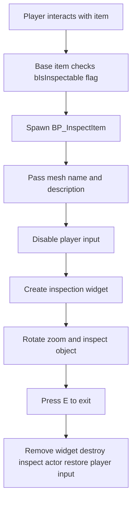

# Lab 2: Building an Object Inspection System

## Overview

In this lab you will create a **robust object inspection system** in **Unreal Engine 5** similar to those used in survival horror and mystery games. The player will be able to inspect an item in a dedicated inspection view, rotate it, zoom in and out, read contextual information, and exit back to normal play.

This lab is highly relevant to your **3D Game Development** module because it combines several core areas of practice: interaction design, Blueprint architecture, UI construction, camera systems, asset presentation, and player feedback. It also maps well to your **ICA** project, where a specialised system such as inspection may directly support environmental storytelling, puzzle design, and readable player interaction within a larger game experience.

The inspection system you build here directly implements the **Examine** interaction verb required by the ICA. If you are working on the ICA in parallel, treat this lab as the technical foundation for that requirement.

The final result should feel like a **production-ready gameplay feature**, not just a technical prototype. This lab has more scope than a single uninterrupted session. It is structured in two tiers so you always have a clear target regardless of how far you get.

| Tier | Parts covered | Outcome |
| :- | :- | :- |
| **Core completion** | Parts 1 – 7 | A fully functional inspection system: player interacts, widget opens, item displays, player can exit. This is the minimum viable result. |
| **Extended completion** | Part 8 | Rotation, zoom, and reset controls added. The system now feels like a polished game feature. |

Do **not** spend excessive time tuning visual details in early parts — get the system working end-to-end first, then refine.

## Learning Goals

By the end of this tutorial you should be able to:

| Topic | You will learn to... | Why it matters |
| :- | :- | :- |
| Blueprint Interfaces | Define an `Inspect` function with data inputs | Decouples interaction from specific actors |
| Actor-based systems | Create a dedicated `BP_InspectItem` actor | Separates normal world logic from inspection logic |
| UI and render targets | Display a 3D item inside a widget | Allows controlled presentation of objects |
| Stateful interaction | Disable player control and hand input to the inspect actor | Prevents conflicting gameplay input |
| Camera control | Use Scene Capture 2D with zoom and reset behaviour | Creates a readable and cinematic inspection view |
| Reusable base items | Configure inspection data through variables | Makes the system scalable for project use |

## Before You Begin

You should already be comfortable with:

- Creating Blueprint classes
- Adding components to actors
- Creating Widget Blueprints
- Setting variables and exposing them on spawn
- Basic input events 

## Recommended Project Setup

Create a dedicated folder structure before you begin.

| Folder | Purpose |
| :- | :- |
| `Blueprints/Inspect` | Inspection system Blueprints |
| `Blueprints/Items` | Reusable item Blueprints and child items |
| `UI/Inspect` | Inspection widget and related UI assets |
| `Materials/Inspect` | Material for displaying the render target |
| `RenderTargets` | Render target asset |

## The Target System

The inspection flow should work like this:

## Part 1: Create the Interface

### Step 1.1 Create the Interaction Interface

In the `FirstPerson/Blueprints` folder create a new function named `Inspect` inside a Blueprint interface called `InteractInterface`.

Use the following inputs.

| Input name | Type | Notes |
| :- | :- | :- |
| `Character` | `BP_FirstPersonCharacter` object reference | The player character using the system |
| `InspectedItem` | `Static Mesh` object reference | The mesh to display |
| `ItemName` | `Text` | The item title shown in the UI |
| `ItemDescription` | `Text` | The descriptive text shown in the UI |

### Why This Matters

Using an interface keeps your interaction architecture flexible. A base item can call `Inspect` on another actor without tightly coupling the two systems together.

## Part 2: Create the Inspection Actor

### Step 2.1 Create `BP_InspectItem`

Inside `Blueprints/Inspect`, create a new **Actor Blueprint** named `BP_InspectItem`.

### Step 2.2 Add Components

Add the following components.

| Component | Name | Purpose |
| :- | :- | :- |
| Static Mesh Component | `Item` | Displays the inspected object |
| Scene Capture Component 2D | `SceneCapture` | Renders the item into the widget |

### Step 2.3 Configure the Scene Capture

Set the `SceneCapture` component so it frames the item clearly.

| Setting | Suggested value | Reason |
| :- | :- | :- |
| Location | `X = -110` or similar relative offset | Moves the camera back from the mesh |
| Field of View | `50` | Produces a closer, more focused view |
| Texture Target (see Part 3 below) | `RT_Inspect` | Sends the captured image to the widget |

### Step 2.4 Implement the Interface

Open **Class Settings** and add your interaction interface to the blueprint.

This allows `BP_InspectItem` to receive the `Inspect` message and configure itself dynamically.

## Part 3: Create the Render Target and UI Material

### Step 3.1 Create the Render Target

Create a **Render Target** called `RT_Inspect`.

| Setting | Value |
| :- | :- |
| Size X | `1024` |
| Size Y | `1024` |

### Step 3.2 Create the Material

Right-click the render target and create a material named `M_InspectCamera`.

### Step 3.3 Configure the Material

Adjust the material settings as follows.

| Setting | Value |
| :- | :- |
| Material Domain | `User Interface` |
| Blend Mode | `TranslucentGreyTransmittance` |

> :pencil: **UE5.7 note.** With Substrate enabled as the default in UE5.7, the blend mode list uses Substrate terminology. For this material, select `TranslucentGreyTransmittance` — it handles uniform alpha-based opacity, which is exactly what the `One Minus → Opacity` path requires. Do not select `TranslucentColoredTransmittance`; that mode is designed for coloured glass or tinted transmittance effects and is not needed here. On earlier UE5 versions with Substrate disabled, the equivalent option is named `Translucent`.

Then connect the graph like this:

| Node connection | Purpose |
| :- | :- |
| Texture Sample `RGB` → `Final Color` | Sends the captured image to the widget |
| Texture Sample `A` → `One Minus` → `Opacity` | Inverts the alpha so the background can be treated as transparent |

### Step 3.4 Configure Scene Capture Show Flags for a Clean Background

> :warning: **This step is required.** Without it, the Scene Capture will render the full game world behind your inspection mesh — including sky, fog, and any geometry — and the background transparency trick in Step 3.3 will not work reliably.

The correct approach is to control exactly what the Scene Capture renders. You have two options; choose the one that fits your project.

**Option A — Disable atmospheric rendering via Show Flags (recommended)**

Select the `SceneCapture` component in `BP_InspectItem`. In the Details panel, find **Scene Capture → Show Flags** and disable the following:

| Show Flag to disable | Reason |
| :- | :- |
| Atmosphere | Removes sky gradient from background |
| Fog | Removes exponential height or atmospheric fog |
| Sky Lighting | Removes ambient sky influence |
| Post Process | Removes bloom, vignette, and other post effects that bleed into the background region |

With these disabled and the inspection actor placed away from any geometry (see Step 6.2), the background region of the captured image will render as black. The `One Minus → Opacity` path in `M_InspectCamera` then correctly treats black as transparent, allowing your widget background blur to show through.

**Option B — Add a black backdrop plane (simpler and more predictable)**

Place a flat plane directly behind the inspection mesh inside `BP_InspectItem` as a component. Assign it a fully black unlit material. This physically blocks whatever is behind the item from the capture, regardless of Show Flags or spawn location. The Opacity path in the material becomes less critical because the background region of the render target is always black.

This option is more robust if your project has complex post-process settings you do not want to override.

### Why This Matters

The render target acts like a live camera feed. The widget is not showing the original world item directly. It is showing the output of a dedicated inspection camera, which gives you more visual control. That control only works if the capture is clean — a leaking sky or fog will make the widget look like a window into the game world rather than a focused item view.

## Part 4: Create the Inspection Widget

### Step 4.1 Create `W_Inspect`

Create a **Widget Blueprint** named `W_Inspect` inside `UI/Inspect`.

### Step 4.2 Add the Main Image

Add a **Canvas Panel** and then add an **Image** to display the inspection camera output.

| Widget element | Configuration |
| :- | :- |
| Image anchor | Center |
| Image size | `1024 x 1024` |
| Brush / appearance | Use `M_InspectCamera` |

### Step 4.3 Add Background Treatment

Create a full-screen background effect.

| Widget element | Configuration |
| :- | :- |
| Border | Anchor full screen, offsets `0` |
| Border tint alpha | `0` |
| Background Blur | Child of the border |
| Blur strength | About `5` |

This gives you a soft cinematic isolation effect while the player inspects the object.

### Step 4.4 Add Text Elements

Add two text blocks:

- `Item Name`
- `Item Description`

Bind these to variables that are:

- **Instance Editable**
- **Expose on Spawn**

Marking variables as Expose on Spawn means they will appear as input pins directly on the **Create Widget** node when you use this widget class. You must wire those pins in Step 7.4 for the item data to arrive at the widget. If you do not wire them, the widget will open with blank text and no error will appear — it will simply show nothing.

### Step 4.5 Add an Exit Prompt

Add a text block in the bottom-right corner.

Suggested prompt:

> Press E to Exit

## Part 5: Prepare the Base Item Blueprint

### Step 5.1 Create Reusable Variables

In your base item blueprint, create the following public variables.

| Variable | Type | Purpose |
| :- | :- | :- |
| `ItemMesh` | Static Mesh | Mesh used by the item |
| `ItemName` | Text | UI title |
| `ItemDescription` | Text | UI description |
| `ItemScale` | Vector | Custom scale in the world |
| `ItemInspectionRotation` | Rotator | Default orientation in the inspection view |
| `bIsInspectable` | Boolean | Whether this item supports inspection |

> :pencil: **Naming note.** The variable is named `bIsInspectable`, not `Inspect`. Unreal Engine convention prefixes boolean variables with `b` to distinguish them clearly from functions and components in the Blueprint graph. The interface function is also named `Inspect`, and having a variable and a callable function with identical names in closely related actors causes persistent confusion in Blueprint autocomplete. Using `bIsInspectable` eliminates that ambiguity.

### Step 5.2 Configure the Construction Script

Use a **Sequence** node in the construction script to:

1. Set the item mesh dynamically from `ItemMesh`
2. Set the relative scale from `ItemScale`
3. Set the relative rotation from `ItemInspectionRotation`

Wiring `ItemInspectionRotation` into the **Set World Rotation** or **Set Relative Rotation** node on your mesh component here ensures the item faces the expected direction when it is spawned into the inspection actor in Part 7.

### Why This Matters

A reusable base item means you can make a child Blueprint such as `BP_Phone`, `BP_Key`, or `BP_NoteObject` and only change the configured variables rather than rebuilding logic each time.

## Part 6: Core Inspection Logic

### Step 6.1 Trigger Inspection from the Base Item

When your normal interaction event fires in `BP_BaseItem`, check whether `bIsInspectable` is `true`.

| Condition | Action |
| :- | :- |
| `bIsInspectable == false` | Ignore or use a different interaction path |
| `bIsInspectable == true` | Spawn the inspection actor |

### Step 6.2 Spawn the Inspection Actor

Spawn `BP_InspectItem` using **Spawn Actor from Class**.

Place the actor far from the playable space so the Scene Capture renders a clean view without interference from level geometry or lights.

| Example spawn location | Reason |
| :- | :- |
| `X = 100000` | Keeps the inspect actor well outside the main level |

> :warning: **Spawn location caveat.** Placing the actor at an extreme offset (such as X = 100,000,000) is a rapid prototype technique, not a production approach. Very large coordinate values can produce floating-point precision artefacts in certain configurations, and will cause problems if your project uses **World Partition** (enabled by default in open-world templates from UE5.3 onwards — check Edit → Project Settings → World Partition). A value of `100,000` Unreal units (about 1 km) is sufficient to keep the actor out of the game camera's frustum and avoids these issues.
>
> For a more robust solution, consider placing the inspection actor in a **dedicated sublevel** with its own lighting and a black backdrop, then streaming that sublevel in during inspection. This completely isolates the inspection scene from the main world and is the approach used in production titles.

### Step 6.3 Pass Data to the Inspection Actor

Immediately call the `Inspect` interface message on the spawned actor and pass in:

- Character reference
- Mesh reference
- Item name
- Item description

## Part 7: Implement `Inspect` Inside `BP_InspectItem`

Inside the `Inspect` event of `BP_InspectItem`, perform the following steps.

### Step 7.1 Store the Character Reference

Promote the incoming character reference to a variable so you can re-enable the player later.

### Step 7.2 Set the Mesh

Set the `Item` static mesh component to the incoming mesh.

You can also apply a default inspection rotation here if you did not handle it in the construction script.

### Step 7.3 Transfer Control

| Action | Reason |
| :- | :- |
| Disable input on the character | Prevents normal gameplay actions during inspection |
| Enable input on `BP_InspectItem` | Allows the inspect actor to receive mouse and key input |

### Step 7.4 Create the Widget

Use a **Create Widget** node with `W_Inspect` as the class.

When you select `W_Inspect`, the node will show additional input pins — one for each variable you marked as **Expose on Spawn** in Step 4.4. Wire your `ItemName` and `ItemDescription` values into those pins. Without this wiring, the widget will open with no text displayed and there will be no error message to tell you why.

Add the created widget to the viewport with **Add to Viewport**, then store it in a variable so you can remove it during exit.

> ## Core Completion Gate
>
> If your system reaches this point and works — interaction triggers the spawn, the widget opens with the correct item mesh and text, and pressing E closes everything cleanly and restores player control — you have completed the **core tier** of this lab.
>
> Test against the checklist in the Testing section before continuing to Part 8. Do not proceed to interactive controls until the core system is stable.

## Part 8: Add Interactive Controls

> **Before implementing input in Part 8, check which input system your project uses.**
>
> Projects created from UE5.1 templates onwards default to the **Enhanced Input System**. Legacy axis events such as `Mouse X`, `Mouse Y`, and `Mouse Wheel Axis` will not fire in Enhanced Input projects. If you try to use them and nothing happens, this is why.
>
> **How to check:** Go to **Edit → Project Settings → Input**. Look at the **Default Classes** section. If you see `Enhanced Player Input` or `Enhanced Input Local Player Subsystem`, you are on Enhanced Input. If you see `Player Input` and `Input Component`, you are on Legacy Input.
>
> Follow the section that matches your project.

### Part 8A: Enhanced Input (UE5.1+ projects — most likely applies to you)

#### Step 8A.1 Create Input Actions

Create three **Input Action** assets inside your `Blueprints/Inspect` folder.

| Asset name | Value type | Purpose |
| :- | :- | :- |
| `IA_Inspect_MouseX` | `Axis1D (float)` | Horizontal rotation |
| `IA_Inspect_MouseY` | `Axis1D (float)` | Vertical rotation |
| `IA_Inspect_Zoom` | `Axis1D (float)` | Mouse wheel zoom |
| `IA_Inspect_Exit` | `Digital (bool)` | Exit inspection |

#### Step 8A.2 Create an Input Mapping Context

Create an **Input Mapping Context** asset named `IMC_Inspect`.

Map the actions as follows.

| Action | Key mapping |
| :- | :- |
| `IA_Inspect_MouseX` | Mouse X |
| `IA_Inspect_MouseY` | Mouse Y |
| `IA_Inspect_Zoom` | Mouse Wheel Axis |
| `IA_Inspect_Exit` | E |

#### Step 8A.3 Add and Remove the Context

In `BP_InspectItem`, at the start of the `Inspect` event (after disabling character input), get the **Player Controller** from your stored character reference, then call **Get Enhanced Input Local Player Subsystem** and use **Add Mapping Context** to add `IMC_Inspect` with a priority of `1`.

On exit, call **Remove Mapping Context** on the same subsystem before destroying the actor.

> This means `IMC_Inspect` is only active during inspection and does not interfere with your normal gameplay input mappings.

#### Step 8A.4 Bind Input Actions

In `BP_InspectItem`, bind `IA_Inspect_MouseX`, `IA_Inspect_MouseY`, `IA_Inspect_Zoom`, and `IA_Inspect_Exit` using **Enhanced Input Action** event nodes, available in the Blueprint event graph.

Proceed to Part 8C for the rotation, zoom, reset, and exit implementation logic — it is identical for both input paths once your axis values are flowing.

### Part 8B: Legacy Input (older projects only)

If your project uses the Legacy Input System, add the following axis mappings under **Edit → Project Settings → Input → Axis Mappings**.

| Axis name | Key | Scale |
| :- | :- | :- |
| `InspectMouseX` | Mouse X | `1.0` |
| `InspectMouseY` | Mouse Y | `1.0` |
| `InspectZoom` | Mouse Wheel Axis | `1.0` |

In `BP_InspectItem`, use **InputAxis** event nodes to read these values.

Proceed to Part 8C for the implementation logic.

### Part 8C: Rotation, Zoom, Reset, and Exit Logic

#### Rotation

Use your `MouseX` and `MouseY` input values to rotate the `Item` component.

Recommended behaviour:

| Condition | Behaviour |
| :- | :- |
| Left mouse button held | Rotate object |
| Left mouse button not held | Do not rotate |

Suggested implementation:

1. Read the incoming axis value from your input binding
2. Branch on **Is Input Key Down** with the **Left Mouse Button** key
3. If true: multiply the axis value by a sensitivity scalar such as `-3`
4. Use **Combine Rotators** with the current `Item` component rotation
5. Apply the combined result back to the `Item` component with **Set Relative Rotation**

You may also map **WASD** keys as alternative rotation controls using the same approach.

#### Zooming

Use your zoom input value to change the **Field of View** on the `SceneCapture` component.

Clamp the value so the framing stays readable.

| Zoom rule | Suggested value |
| :- | :- |
| Minimum FOV | `30` |
| Maximum FOV | `80` |

Multiply the wheel axis value by a zoom speed scalar (try `-5`), add it to the current FOV, clamp between 30 and 80, then set the result on the `SceneCapture` component.

#### Reset

Map the **Right Mouse Button** to reset the item to:

- Its initial inspection rotation (store this on entry to the Inspect event)
- The default FOV value (e.g., `50`)

This is an important usability feature. Players frequently rotate an item into an orientation they cannot recover from, and reset allows them to return to a known baseline.

#### Exit

When the player presses the exit key (`E` or your bound `IA_Inspect_Exit` action):

1. Remove the stored widget reference from its parent with **Remove from Parent**
2. Re-enable input on the stored character reference
3. If on Enhanced Input, remove `IMC_Inspect` from the subsystem
4. Call **Destroy Actor** on `BP_InspectItem`

This cleanly returns the player to normal gameplay with no leftover state.

## Part 9: Create a Child Item

Create a child Blueprint from `BP_BaseItem` for a specific inspection object such as a phone, key, photograph, note, toy, or puzzle clue.

Configure the Details panel values.

| Setting | Example |
| :- | :- |
| `ItemMesh` | `SM_Phone_01` |
| `ItemName` | `Old Phone` |
| `ItemDescription` | `The casing is cracked and the battery cover is loose.` |
| `bIsInspectable` | `True` |
| `ItemInspectionRotation` | Custom viewing angle |

This should now be fully inspectable in-game.

## Recommended Implementation Notes

| Design decision | Recommendation |
| :- | :- |
| Spawn location | Use `X = 100,000` or a dedicated sublevel; avoid extreme values if using World Partition |
| Collision | Disable unnecessary collision on the inspection actor |
| Lighting | Add a fixed point light to the inspection actor for consistent visibility |
| Input routing | Only one system should own input at a time; always restore character input on exit |
| Cleanup | Always remove widget and destroy actor when exiting — test this with repeated enter/exit cycles |
| Input system | Confirm Enhanced vs Legacy before implementing Part 8; do not mix both |

## Common Problems and Fixes

| Problem | Likely cause | Fix |
| :- | :- | :- |
| Item does not appear in widget | Render target or material not set correctly | Check `RT_Inspect`, `M_InspectCamera`, and Scene Capture Texture Target |
| Background is visible or opaque | Show Flags not configured; material alpha path incorrect | Follow Step 3.4; check `One Minus` into `Opacity`; or add a black backdrop plane |
| Player can still move while inspecting | Character input not disabled | Disable input on the player character during the `Inspect` event |
| Rotation does not respond at all | Using legacy axis events in an Enhanced Input project | Check Project Settings; follow Part 8A if Enhanced Input is active |
| Rotation feels wrong | Axis signs or sensitivity values are off | Invert the multiplier or reduce sensitivity |
| Zoom becomes unusable | No clamping applied | Clamp FOV between 30 and 80 |
| Exit does not restore play | Widget or actor cleanup incomplete | Remove widget, enable player input, remove mapping context if Enhanced, then destroy actor |
| Widget opens with blank text | Expose on Spawn pins not wired on Create Widget node | In Step 7.4, wire `ItemName` and `ItemDescription` into the pins that appear on the Create Widget node |
| Floating point artefacts or invisible actor | Spawn location too extreme; World Partition active | Reduce spawn offset; see Step 6.2 caveat |

## Testing Checklist

Use the following checklist before you consider the system complete.

### Core Tier

| Test | Pass criteria |
| :- | :- |
| Interact with an inspectable object | Inspection mode opens reliably |
| Widget display | Mesh appears clearly, item name and description are correct |
| Background | Widget background is clean — no sky, fog, or level geometry visible |
| Exit | Player cleanly returns to normal control; widget removed; actor destroyed |
| Repeated cycles | Enter and exit inspection five times in sequence — no broken state |

### Extended Tier

| Test | Pass criteria |
| :- | :- |
| Rotation | Item rotates smoothly and predictably with mouse or keys |
| Zoom | Player can zoom in and out without breaking framing |
| Reset | Right mouse button returns to default rotation and FOV |
| Reuse | At least one child item works without duplicating logic |
| Input isolation | Normal player actions (movement, jump, other interactions) are blocked during inspection |

## Conclusion

This lab gives you a reusable gameplay system that is especially valuable in **environmental storytelling**, **escape-room design**, **narrative clue discovery**, and **horror interaction design**. More importantly, it demonstrates how to combine multiple Unreal systems — interfaces, scene capture, widgets, input management, and actor lifecycle — into a coherent player-facing feature.

A strong solution should feel deliberate, readable, and stable. Aim for a result that could genuinely be integrated into your **ICA** project rather than a one-off technical exercise.

After completing this lab, a sensible next step would be to combine the inspection system with:

- clue-based puzzle progression
- object state changes
- cinematic reveals
- locked-door or escape-room mechanics

That would turn inspection from a standalone feature into a meaningful part of a complete gameplay loop.

## Glossary

| Term | Definition |
| :- | :- |
| **Blueprint Interface** | An asset that defines function signatures without implementing them. Any Blueprint that implements the interface can receive those function calls, enabling decoupled communication between actors. |
| **Scene Capture 2D** | A component that acts as an in-world camera, rendering its view into a Render Target rather than the screen. Used here to capture the inspected item independently from the main game world. |
| **Render Target** | A texture asset that receives live rendered output from a Scene Capture or similar source. Can be sampled in materials and displayed in UI widgets. |
| **Expose on Spawn** | A variable property that, when enabled alongside Instance Editable, causes the variable to appear as an input pin on the **Create Widget** node. Required for passing runtime data into a widget at construction time. |
| **Enhanced Input System** | Unreal Engine's modern input framework (default from UE5.1 onwards). Uses Input Action assets and Input Mapping Contexts to manage bindings rather than legacy axis and action names in Project Settings. |
| **Input Mapping Context (IMC)** | An Enhanced Input asset that maps Input Actions to physical keys or axes. Can be added and removed at runtime, allowing input schemes to change based on game state — for example, swapping to inspection controls when the player examines an item. |
| **Input Action (IA)** | An Enhanced Input asset representing a single logical input event (e.g., "rotate horizontal"). Decoupled from any specific key; the key binding lives in the IMC. |
| **bIsInspectable** | A boolean variable on the base item Blueprint indicating whether this item supports the inspection interaction. Follows the Unreal Engine `b` prefix convention for boolean properties. |
| **TranslucentGreyTransmittance** | The Substrate blend mode to use for `M_InspectCamera`. Handles uniform alpha-based opacity — black is fully transparent, white is fully opaque. Equivalent to the legacy `Translucent` blend mode in pre-Substrate UE5 projects. Use this for the render target UI material. |
| **TranslucentColoredTransmittance** | A Substrate blend mode for coloured glass and tinted transmittance effects. Not appropriate for the inspection material; included here for reference only. |
| **Show Flags** | Per-component rendering flags on a Scene Capture 2D that control which engine features (atmosphere, fog, post process, etc.) are included in the capture output. |
| **World Partition** | An Unreal Engine system for streaming large open worlds. Enabled by default in open-world templates from UE5.3 onwards. Actors placed at extreme world coordinates may behave unexpectedly in World Partition projects. |
| **Sublevel** | A secondary level asset that can be loaded and unloaded at runtime. A dedicated inspection sublevel with controlled lighting and a black backdrop is the production-grade alternative to the spawn-offset technique. |
