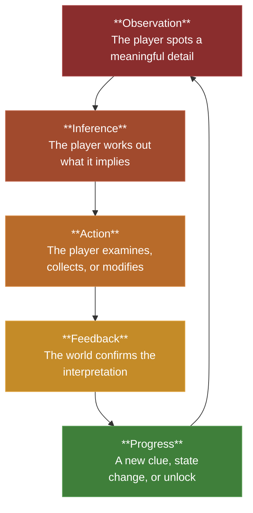
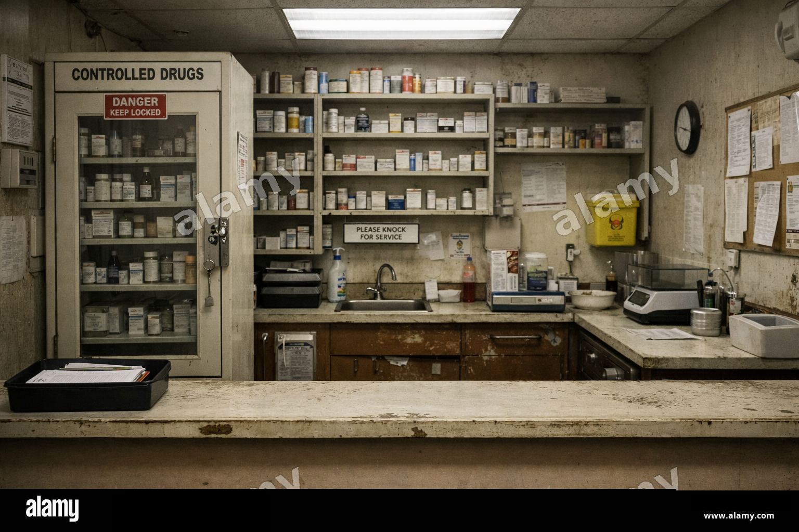

# Interaction Design: Designing Investigation Satisfaction Through Observation, Inference, and Cause-and-Effect

> These notes are production-oriented. The goal is not to study detective fiction in the abstract — it is to help you design a small, readable, playable escape-room micro-experience in which the player feels clever because they observed, inferred, and acted correctly. Every principle here connects directly to the clue-solving structure required by the ICA and to the three required interaction verbs: Examine, Collect, and Modify. 

## Ten Guidelines for Satisfying Clue Design

The following guidelines are intended to help you design clue-driven spaces that feel readable, purposeful, and rewarding to solve. Think of them as practical design principles to return to whenever you are planning props, clue chains, or player interactions. The more clearly your room follows these ideas, the more likely the player is to feel that satisfying sense of having worked something out for themselves.

1. **Treat props as evidence, not just decoration.** The most useful props reveal something about character, event, habit, motive, or mechanism.
2. **Let observation lead naturally to inference.** It is not enough for the player to notice an object; they should be able to work out why it matters.
3. **Let inference shape the next action.** A strong clue changes what the player tries, checks, or reconsiders next.
4. **Hide meaning in plain sight.** Place clues fairly and visibly, then let the player earn the interpretation through attention and reasoning.
5. **Use clues to narrow possibility.** Good clues bring the player closer to an answer rather than simply adding atmosphere.
6. **Use contradiction to spark curiosity.** When something does not quite fit, players are much more likely to stop, question, and investigate.
7. **Give puzzle elements narrative context.** Locks, switches, codes, and objects feel stronger when they belong naturally to the room and its story.
8. **Aim for hindsight clarity.** The best solutions feel surprising at first, but obvious once the player reflects on the clues.
9. **Teach the player how to read the room.** Early clues should help establish what kinds of details matter in this particular space.
10. **Reward reasoning over luck.** The goal is for the player to feel observant and capable, not fortunate for stumbling across the answer.

## Reviews of Relevant Games

- [The Vanishing of Ethan Carter](https://www.youtube.com/watch?v=0nYic8XaAtQ)
- [What Remains of Edith Finch](https://www.youtube.com/watch?v=MYO_3hWPoqA)
- [Return of the Obra Dinn](https://www.youtube.com/watch?v=erMbuLHJR3o)
- [The Room](https://www.youtube.com/watch?v=pMmyhp_5oSA)
- [The Room VR: A Dark Matter](https://www.youtube.com/watch?v=vNCSvmZKwjQ)
- [Outer Wilds](https://www.youtube.com/watch?v=Ao8LGgYlgcI)

These games are not included because they represent a definitive or canonical set of best-practice examples. They are included to get you thinking about different ways games can structure clues, guide attention, reward observation, and create satisfying moments of discovery.

## 1. Why Clue Solving Satisfaction Matters

The most common weakness in student escape-room work is not usually technical failure. It is narrative and mechanical flatness. The room may contain assets, interactables, and even a functioning puzzle, but the experience does not produce satisfaction because the player is not asked to think in an interesting way.

A mechanically complete room can still feel dead if props operate only as decoration, if clues are arbitrary, or if the solution depends on brute-force trying rather than interpretation. In a strong escape-room micro-experience, the player should feel that the room is speaking to them. The environment presents evidence. The player reads that evidence. The puzzle is solved by understanding the space rather than merely exhausting inputs.

That is the core satisfaction you should be designing toward. The player should feel, briefly, like Sherlock Holmes: not because the room contains Victorian aesthetics or detective clichés, but because the room rewards close observation, pattern recognition, and inference.

This aligns directly with the ICA, where the puzzle elements are solved by examining clue props in the room, and where storytelling is expected through layout, props, lighting, and materials. 

<h4>Poor clue design vs well-designed clue placement</h4>

**Bad clue design:** A poorly designed clue is technically present in the room, but it does not feel meaningfully connected to the space, the story, or the player’s reasoning process. For example, imagine the code for a locked drawer is simply written on a scrap of paper hidden under a random vase in the corner of the room. The player may eventually find it, but the discovery feels arbitrary. It rewards blind searching rather than observation, inference, or understanding. The clue behaves like a concealed answer, not like evidence, so the player does not feel clever — only lucky or relieved.

**Good clue design:** Now imagine the same drawer code is revealed through a cluster of readable details on the main desk of a watchmaker. A wall calendar is frozen on a specific date, three stopped pocket watches display three different times, and a handwritten note mentions “the hour he always feared most.” The player must observe the desk, recognise that the objects belong together, and infer which time matters. Here, the clue is embedded in the character, routine, and narrative of the room. The answer is still hidden, but the meaning is visible in plain sight. When the player solves it, the feeling is not “I found the code,” but “I worked out what this room was telling me.”

## 2. The Fundamental Clue Loop

Every satisfying clue-driven interaction follows the same basic loop:

**See -> Notice -> Infer -> Test -> Confirm -> Progress**

If any step in this chain is weak, the player experience becomes weaker.

- **See** — the player must be able to visually find the clue or be meaningfully drawn toward it.
- **Notice** — the clue must contain a detail that stands out from its context.
- **Infer** — the player must be able to interpret what that detail means.
- **Test** — the player applies that inferred meaning to a nearby object, system, or puzzle element.
- **Confirm** — the game gives clear feedback that the interpretation was correct or incorrect.
- **Progress** — the clue changes the state of the room, the player's understanding, or both.

When students skip the inference step, the clue becomes a lookup. When they skip the confirmation step, the puzzle feels muddy. When they skip progress, the clue feels pointless.

### Clue Flow Diagram

The important design point is that clue solving is **not a single interaction**. It is a **loop** of perception and response.

## 3. What a Clue Actually Is

Students often treat clues as text fragments, numbers on paper, or objects that contain answers. That is too narrow. A clue is any readable feature of the environment that allows the player to infer something useful.

A **clue** can be:

- a physical **detail** on a prop
- a **relationship** between two props
- a **contradiction** in the room
- a **pattern** in materials or wear
- a **missing** object
- a **repeated** symbol
- a **sound** tied to a location or mechanism
- a **light** state that implies power, use, or priority
- an **arrangement** of objects that reveals habit or sequence

The clue is not the object itself. The clue is the **meaningful difference** the player notices in or around that object.

For example:

- The clue is not the desk. The clue is that one drawer has heavy wear around the handle while the others do not.
- The clue is not the bookshelf. The clue is that one title breaks an otherwise consistent categorisation system.
- The clue is not the cabinet. The clue is that scratch marks around the lock suggest repeated, urgent use.

That distinction matters because it forces the student to design for interpretation rather than just placement.

## 4. The Three Functions of a Strong Clue

Every strong clue should do at least one of the following things, and the best clues often do two or three at once.

### 4.1 It tells the player what happened here

A room should feel like a frozen moment in an unfolding story. Clues should imply prior action.

Examples:

- an overturned stool near a locked cupboard
- a mug beside an unfinished note
- mud tracks leading to a secondary workspace
- a smashed bulb replaced by one warmer practical lamp
- a tool laid down beside an interrupted task

These details imply event.

### 4.2 It tells the player who used this space

Environmental storytelling becomes richer when props imply a specific occupant rather than a generic room theme.

Examples:

- neatly labelled containers suggest methodical behaviour
- improvised repairs suggest resourcefulness or desperation
- religious imagery mixed with contraband suggests contradiction
- personal items hidden in a work area suggest secrecy
- repeated handwritten corrections suggest obsession or anxiety

These details imply character.

### 4.3 It tells the player what to do next

The clue must eventually become actionable.

Examples:

- a highlighted frequency suggests which radio to inspect
- burn marks beneath a fuse board suggest a power-routing puzzle
- a calendar entry next to three bottle colours implies an order
- a cabinet label matching a note on a bench suggests cross-reference
- a diagram with one missing component points the player to an absent part

These details imply action.

A clue that only adds atmosphere can still be useful, but the best clue props also steer progression.

## 5. Observation Versus Explanation

A weak room explains itself too directly. A stronger room allows the player to arrive at the explanation.

This does not mean being obscure. It means shifting from explicit exposition to readable implication.

Weak approach:

- a note saying: “The code is 4312.”

Stronger approach:

- four labelled specimen jars on a bench
- one logbook page listing the order in which they were stabilised
- corresponding residue colours on the valve handles
- a nearby lock with four inputs

The player still reaches 4312, but now the number has been earned.

The design target is not confusion. The design target is **structured inference**.

## 6. The Mechanics of Examine, Collect, and Modify

The ICA constrains students to three verbs only: Examine, Collect, and Modify. That is not a limitation. It is an excellent design constraint because it forces clarity. Each verb should do a specific kind of clue work. 

### 6.1 Examine is the verb of interpretation

Examine is where the player learns to read the room. It should not merely display flavour text. It should reveal information that recontextualises nearby objects or systems.

A good Examine interaction should do three things:

- frame the prop clearly
- reveal a precise detail
- cause the player to think differently about the room

Good Examine examples:

- reading the dosage note that explains why one cabinet shelf is empty
- inspecting a stained glove that links the preparation bench to the locked safe
- examining a maintenance clipboard that reveals a sequence, location, or procedural rule

Poor Examine examples:

- generic lore text that does not affect play
- redundant description of what the player can already see
- clues so explicit that they remove all inference

### 6.2 Collect is the verb of commitment

Collect says: this object matters enough to move from world-space into player-space.

A collected object should either:

- complete a clue chain
- enable a Modify action
- confirm a theory the player has formed

Good Collect examples:

- taking a labelled key after deducing which desk actually belongs to the occupant
- retrieving a fuse after noticing which machine is the real power source
- collecting a reagent after working out which storage area is still in use

Collect should feel justified. Do not scatter collectible objects randomly around the room with no narrative or deductive logic.

### 6.3 Modify is the verb of consequence

Modify is where the player's understanding changes the world.

A good Modify action is not just button pressing. It is the moment the player's interpretation becomes physical consequence.

Good Modify examples:

- entering the sequence implied by the clue chain
- placing the collected item into the correct machine or holder
- restoring power to the correct subsystem rather than every subsystem
- aligning three components based on observed evidence from the room

The ICA requires at least one Modify to be gated by prior Examine or Collect, and that should be treated as a clue-design opportunity rather than a checklist item. 

## 7. Clue Chains, Not Isolated Clues

Students often place clues as single isolated puzzle objects. That produces shallow interaction. Better rooms are built from clue chains.

A clue chain is a sequence in which one clue changes how the next clue is read.

### Typical structure of a clue chain

- **Broad clue** — establishes suspicion or points to a zone
- **Focused clue** — narrows attention to a smaller set of props
- **Specific clue** — provides the exact interpretable detail
- **Action clue** — tells the player what to try
- **Feedback clue** — confirms success and opens the next step

### Example clue chain

A disused watchmaker's room:

- Broad clue: one workbench is dust-free while the rest of the room is neglected
- Focused clue: that bench contains fresh oil and a missing watch casing
- Specific clue: a repair ticket mentions “third bell after winding”
- Action clue: the player winds the three clocks and listens/observes the correct one
- Feedback clue: a hidden compartment opens in the third clock

What makes this work is not complexity. It is directionality. Each clue reorients the player's attention.

## 8. Contradiction Is One of Your Strongest Tools

The easiest way to provoke curiosity is to place two facts in the room that do not comfortably belong together.

Examples:

- a spotless surgical instrument in an otherwise filthy room
- children's drawings in a secure server area
- expensive liquor hidden in a modest office
- fresh flowers in an abandoned workshop
- careful religious icons beside evidence of theft or deceit

Contradiction works because it triggers a question. The player wants to resolve the inconsistency.

That question is the beginning of clue solving.

A useful design prompt for students is:

**What in this room would make a careful observer stop and think: that is odd?**

If they cannot answer that, the room may be readable, but it is not yet interesting.

## 9. Cause and Effect Must Be Visible

A detective-style puzzle is satisfying only when the player can see that their interpretation changed the world.

This is especially important for Modify interactions. The state change should be spatially readable and not hidden entirely in UI.

Examples of strong feedback:

- a locked cabinet opens with an audible release and a motivated light shift
- a machine powers up and illuminates a previously dark area
- a hidden drawer slides out from the wall with a clear sound cue
- Niagara sparks, steam, dust, or glow reinforce the state change
- a short camera sequence frames the consequence of the player's action

This aligns well with the ICA's expectation that Modify actions use clear visual and audio feedback, and that Niagara and camera sequence support progression. 

## 10. Designing Clues Through Prop Categories

Not all props should do the same work. The room needs a hierarchy.

### 10.1 Hero clue props

These are the most important objects in the room. They should be few in number, clearly framed, and strongly connected to the puzzle.

Examples:

- the ledger with the critical sequence
- the locked medicine cabinet
- the broken switchboard
- the ritual altar with missing components

### 10.2 Secondary clue props

These support the hero clue props by providing context, partial evidence, and corroboration.

Examples:

- receipts
n- labels
- wall diagrams
- personal effects
- maintenance tools
- supporting notes

### 10.3 Tertiary storytelling props

These deepen the narrative but should not compete with the main clue chain.

Examples:

- a cracked teacup repaired with adhesive
- worn floor sections implying habitual movement
- old family photos
- empty packaging
- cleaning supplies in unusual locations

The hierarchy matters because a room with too many hero-scale clues feels noisy and arbitrary. Students should be ruthless in deciding which props actually matter.

## 11. Materials as Clues

Students often think of materials as visual polish. In this ICA, materials can and should carry narrative and mechanical information.

A surface can communicate:

- age
- habit
- neglect
- damage
- repair
- contamination
- heat
- moisture
- recent disturbance

Examples:

- a clean rectangle in dust where an object used to sit
- greasy fingerprints around one handle only
- rust streaks beneath a leak indicating persistent water flow
- polished floor wear showing a repeated route
- chipped paint revealing a part of the machine that is constantly accessed

These are not just visual details. They are prompts for inference.

This is especially relevant to the ICA requirement for a student-authored Substrate material that meaningfully supports storytelling-through-materials. 

## 12. The Difference Between Fairness and Obscurity

A clue-based puzzle should be challenging in thought, not in visibility or access.

A fair puzzle:

- gives the player enough information to reason correctly
- uses consistent clue language
- confirms useful observations
- avoids requiring random combinations or brute force
- ensures the critical clue is discoverable

An unfair puzzle:

- hides required information too well
- uses arbitrary solution logic disconnected from the room
- requires leaps the room never teaches
- depends on pixel hunting
- withholds confirmation, making the player unsure whether they are wrong or unfinished

Students often confuse “difficult” with “well hidden.” In practice, a better target is clarity with interpretive depth.

## 13. Designing the Player's “I Knew It” Moment

The strongest payoff in an escape room is not surprise alone. It is retrospective clarity.

The player should reach a point where they think:

- I should have spotted that earlier.
- The room was telling me all along.
- That explains why those details were there.
- The answer fits the story of the space.

That feeling depends on three things:

- the answer was visible in some form before the solve
- the clues were coherent and cumulative
- the final action resolves an uncertainty built up by the room

Students should therefore design backward from the payoff moment.

Ask them:

- What is the final realisation?
- Which earlier clues make that realisation fair?
- Which prop first teaches the player what kind of observation matters here?

## 14. A Practical Design Method for Students

Before building clue props in-engine, students should answer the following for each major puzzle element.

| Question | What it forces you to decide |
| :- | :- |
| What is the player supposed to realise here? | The intended inference |
| Which object communicates that realisation? | The clue carrier |
| What specific detail on that object matters? | The readable difference |
| Why would the player look at it? | Framing, lighting, placement, contradiction |
| What should the player do after noticing it? | Action link |
| How will the world confirm they were right? | Feedback design |

If a student cannot answer all six questions, the clue is probably underdesigned.

## 15. Common Failure Modes in Student Clue Design

### 15.1 The answer is arbitrary

The clue does not logically connect to the solution. The room might contain atmosphere, but the reasoning path is weak.

### 15.2 The answer is too explicit

The player reads one note and immediately knows the solution. This removes the pleasure of inference.

### 15.3 The clue is visible but not legible

The prop exists, but its important detail cannot be easily seen, framed, or understood.

### 15.4 The room contains too many equally important clues

Nothing feels prioritised. The player does not know where to look or what matters.

### 15.5 The feedback is too weak

The player performs the correct action, but the state change is too subtle to reward them properly.

### 15.6 The narrative and the mechanics are separate

The room tells one story, but the puzzle logic feels imported from somewhere else.

Students should review their work specifically for these failures.

## 16. Quick Reference: Clue Design Checklist

Use this at each project milestone. It is a production discipline tool, not a submission rubric.

| Principle | Check |
| :- | :- |
| **Readable clue carrier** | Can the player clearly see the prop that matters? |
| **Meaningful difference** | Is there a specific detail that makes this prop worth noticing? |
| **Inference** | Can the player conclude something useful from that detail? |
| **Action link** | Does the clue change what the player should do next? |
| **Verb fit** | Is this best handled through Examine, Collect, or Modify? |
| **Narrative fit** | Does the clue belong to the room's story and occupant logic? |
| **Spatial fit** | Is the clue placed where it makes sense in the environment? |
| **Fairness** | Is the required information genuinely discoverable? |
| **Feedback** | Does correct interpretation trigger visible and audible consequence? |
| **Chain logic** | Does this clue connect to earlier and later clues? |
| **Contradiction or emphasis** | Is there a reason the player would pay attention here? |
| **Material storytelling** | Could wear, residue, damage, or cleanliness strengthen the clue? |

## Reflective Questions

These questions are intended for individual reflection after a greybox or clue-pass review and may be used as the basis for in-class critique. Answer them with reference to your current build state, not your intended final state.

1. **Core payoff.** What is the single observation in your room that you most want the player to feel proud of making?
2. **Clue carrier.** Which prop currently carries the most important clue in your room? Why that prop rather than another?
3. **Inference.** What exactly is the player supposed to conclude after examining that prop?
4. **Action.** What should the player do next because of that conclusion?
5. **Chain structure.** Does the clue stand alone, or is it part of a sequence that progressively narrows interpretation?
6. **Fairness.** Could a first-time player reasonably discover the clue without external help or brute force?
7. **Contradiction.** What in the room feels odd, inconsistent, or suspicious enough to invite investigation?
8. **Narrative fit.** Does the clue make sense as part of the room's story, or does it feel like a puzzle object inserted from outside the fiction?
9. **Material storytelling.** What could wear, damage, residue, dust, moisture, or polish add to the player's understanding here?
10. **Feedback quality.** When the player is correct, how does the room visibly reward that correctness?
11. **Verb discipline.** Are you using Examine to reveal information, Collect to commit significance, and Modify to create consequence?
12. **Production honesty.** Which clue in your current build is weakest, and what is the real reason it is weak — visibility, logic, fairness, or feedback?

## Designing Your Clue Structure — Practical Steps

> Complete these steps before building your final clue props. The goal is not to produce more objects. The goal is to produce a more coherent reasoning path.

### Step 1 — Name the Final Realisation

Write one sentence stating what the player must finally understand in order to escape.

### Step 2 — Identify the Three Most Important Props

List the three clue-bearing props that matter most to reaching that realisation. If you have more than three equally critical props in a small room, you may have an overcomplicated structure.

### Step 3 — Define the Meaningful Difference

For each prop, write the exact detail that matters: wear pattern, note correction, missing object, residue, arrangement, contradiction, or state difference.

### Step 4 — Map Each Prop to a Verb

Decide whether each clue is primarily delivered through Examine, Collect, or Modify. Do not let all three verbs collapse into generic “press E” behaviour.

### Step 5 — Write the Inference Chain

Write the clue chain in plain sentences:

- Because I saw X, I think Y.
- Because I think Y, I will try Z.
- When I try Z, the room should confirm A.

### Step 6 — Check the Room for Narrative Coherence

Ask whether every major clue still makes sense as part of the room's story, occupant, and recent events.

### Step 7 — Add One Contradiction

Introduce one suspicious detail that provokes deeper looking without breaking plausibility.

### Step 8 — Strengthen the Feedback

Ensure the final correct Modify action produces a visible, audible, and spatially readable consequence.

### Step 9 — Remove One Redundant Clue

If two props communicate the same information with no added depth, remove one. Compression usually improves clarity.

### Step 10 — Test With a Fresh Observer

Watch another person play. Do they feel confused in a productive way, or merely lost? If they solve through guessing, your clue structure is too weak. If they never get traction, it is too obscure.

<h4>Example - Decommissioned Hospital Pharmacy: Clue Mechanics Breakdown</h4>

> The following example uses the same kind of production-oriented environment logic as the attached interior design notes, but reframes it around clue structure, inference, and interaction. 

Late 1970s institutional dispensary. Partial flooding. Emergency lighting only. The exit is controlled by a locked internal security system.

### Core player fantasy

The player should feel that they have reconstructed what the absent pharmacist was trying to do in the moments before evacuation.

### Broad room story

A compound was being prepared during a crisis. The procedure was interrupted. The player must work out the intended formulation order from the evidence left behind.

### Clue chain

| Stage | Prop or detail | What the player infers | Result |
| :- | :- | :- | :- |
| 1 | Dispensing counter logbook left open to a partially completed entry | A specific compound was being prepared, not random stock handling | The player now knows the room's activity had procedure and order |
| 2 | Preparation bench with three labelled containers, one empty measuring dish, and residue colours | Only certain substances were used together, and in a sequence | The player begins connecting labels, colours, and order |
| 3 | Wall chart showing safe handling order for compounds, with one handwritten correction | The official process was altered by the pharmacist | The player realises the handwritten note matters more than the default chart |
| 4 | Locked drug cabinet with three rotary inputs and scratch marks around one dial | The final cabinet input depends on the corrected compound order | The player applies the inferred order to the cabinet |
| 5 | Cabinet unlocks, revealing a key card and restoring local power | Their interpretation was correct | Escape progression continues |

### Verb mapping

| Verb | Use in the example | Why it matters |
| :- | :- | :- |
| **Examine** | Logbook, wall chart, stained measuring dish | Provides readable evidence and recontextualises nearby props |
| **Collect** | Key card from cabinet | Converts solved understanding into progression item |
| **Modify** | Entering the corrected sequence into the cabinet lock | Makes the player's inference physically consequential |

### Why this feels better than a random code

The answer is not “hidden” in a single arbitrary note. It is distributed across multiple props. The player is asked to compare, notice contradiction, and privilege one source of evidence over another. That produces a modest but genuine detective-style payoff.

### Additional environmental storytelling details

- one stool knocked back from the preparation bench suggests haste
- water line on lower shelving implies the flooding happened after the work was interrupted
- a single portable lamp near the chart suggests that area was used in emergency conditions
- one cabinet handle is cleaner than the others, implying repeated recent access

These details are not separate from the puzzle. They increase the room's credibility and teach the player what kinds of observations matter.

