# Interior Level Design for 3D Games

> These notes are production-oriented. The goal is not to study interior design in the abstract — it is to help you build a clean, readable, shippable vertical slice within your assignment(s). Every principle here connects directly to a design or implementation decision you need to make during production. 

---

## Ten Guideline for Interior Level Design

These are the non-negotiable principles that govern every decision in this document. They are not guidelines — they are the conditions under which an interior space works. Violating any one of them does not produce an interesting exception; it produces a broken space.

1. **Greybox before you decorate.** Validate spatial flow, scale, and mechanic fit before placing a single final asset. A polished broken layout is still broken.

2. **Every light must be motivated.** If you cannot identify the physical source that justifies an engine light, the light has no right to exist in the scene.

3. **Three depths, always.** Every space, viewed from its entry point, must read across foreground, mid-ground, and background. A flat room is a legibility failure.

4. **One point of interest per zone.** Two competing focal lights give the player no priority signal. Competing centres of attention cancel each other out.

5. **Hero props are earned, not placed.** A space with ten hero-scale objects has no heroes. Keep the count ruthlessly low. Scarcity is what creates significance.

6. **Every prop must justify its presence.** Through mechanic, narrative, or habitation logic. Decoration for its own sake is set dressing without authorship.

7. **The primary path is communicated by light, openness, and silhouette — not by markers.** If the player needs a waypoint to navigate your space, the space is unreadable.

8. **Scale is set by the mannequin, not by feel.** Calibrate every door frame, surface height, and ceiling against the default mannequin before assets are placed.

9. **Negative space is a design tool.** Empty floor communicates pacing, exposure, and the scale of what surrounds it. Filling every surface is a greybox failure.

10. **The space must play before it looks.** A layout that has not been tested in greybox cannot be rescued by material quality, lighting, or post-process polish.

---

## 1. Why Interior Spaces Demand Discipline

Interior spaces are the hardest environment type to get right at student production scale. Not because they are technically complex, but because they are unforgiving — there is nowhere to hide. An exterior environment can absorb a lot of error through atmospheric haze, draw distance, and visual noise. An interior space is close-range, high-contrast, and navigated slowly. Every gap in a wall tile, every floating asset, every unmotivated light source, every overcrowded surface is immediately visible.

Interior level design is not a secondary concern addressed after core systems are working. It is a primary production concern that must be greyboxed, validated, and iterated in parallel with gameplay systems — because the space and the mechanic are inseparable. A space that looks polished but plays poorly is a failed design. A space that plays cleanly will survive a visual polish pass. The reverse is not true.

**On interior performance in Unreal Engine.** There is no sky atmosphere contributing fill light. Your indirect bounce illumination is entirely Lumen's responsibility, and Lumen in enclosed spaces is expensive if you let it be. Tight rooms with clear occlusion boundaries — walls that fully enclose volumes, doorframes that break sightlines — are significantly cheaper to render than open-plan spaces with long unobstructed sight distances. Design for occlusion from the blockout stage, not as a post-hoc optimisation.

<!-- Search: "Resident Evil 2 Remake" "police station" screenshot press kit | Source: capcom-europe.com/press/ | Use the main hall shot with central statue -->
<a href="./images/interior/resident-evil-2-police-station.jpg" target="_blank" rel="noopener">
  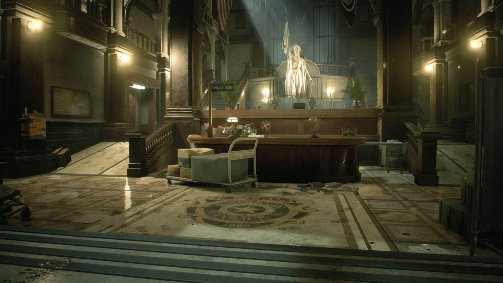
</a>

*RE2's Police Station is the canonical reference for readable interior grammar at mid-budget production scale. Constrained corridors force legible decision points; doorframe reveals preview the next space before commitment; lighting hierarchy is established entirely through practical sources. The complexity is editorial, not technical — which is why it is achievable at student scale.*

<!-- Search: "Mass Effect Legendary Edition" "Normandy CIC" screenshot | Source: ea.com/press | Use entry or overhead angle showing hub layout -->
<a href="./images/interior/mass-effect-normandy.png" target="_blank" rel="noopener">
  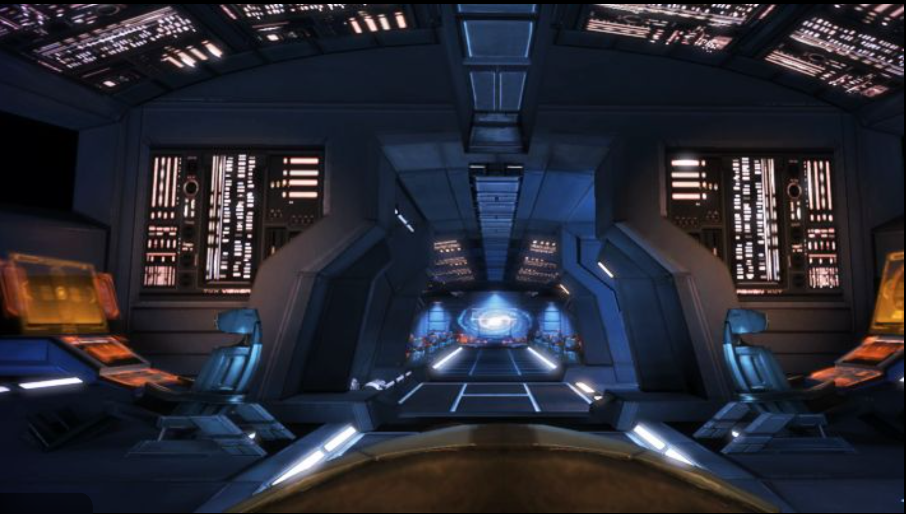
</a>

*The Normandy CIC is the reference model for hub-and-spoke interior design at a compact scale. Every department radiates from a legible central position. The player always knows where they are and how to return to neutral. Hub-and-spoke layout at this scale is not complex to build — it is a discipline of restraint and clarity.*

<!-- Search: "Red Dead Redemption 2" saloon interior press screenshot | Source: rockstargames.com/newswire | Valentine or Flatneck Station saloon, showing bar/tables/entrance depth -->
<a href="./images/interior/red-dead-redemption-salon.png" target="_blank" rel="noopener">
  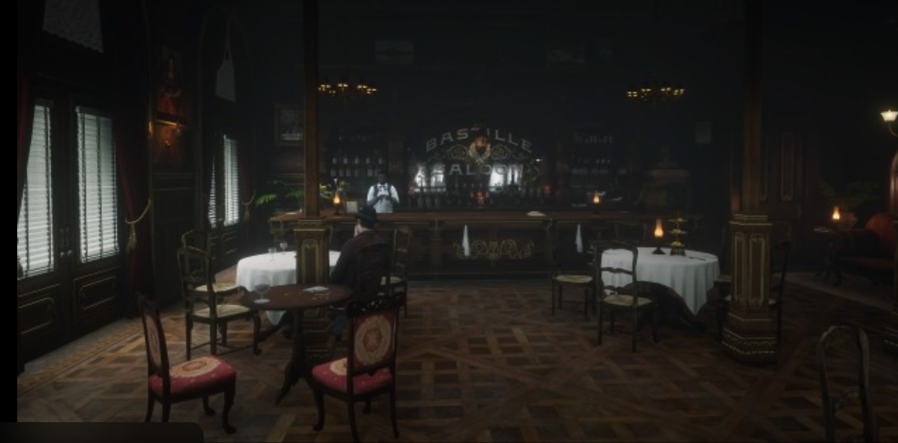
</a>

*The RDR2 saloon demonstrates three-depth layering — bar at the rear, tables at mid-ground, entrance at foreground — that the player reads instinctively without UI guidance. Every zone serves a functional gameplay purpose. The layout communicates social hierarchy, function, and movement logic simultaneously.*

---

## 2. Greybox First. No Exceptions.

The single most important production discipline for interior spaces is greyboxing before decorating. This is not a beginner suggestion — it is industry standard practice at every studio scale, and it is the difference between an interior that works and one that looks polished but plays poorly.

### What a Greybox Is

A greybox is a complete, playable representation of your interior built entirely from **BSP geometry or untextured Static Mesh cubes**, at correct human scale, with temporary lighting only. It should take one to two days to build. Everything that needs to happen in that space — navigation, interaction, combat, management, camera sequences — should be testable in the greybox before a single asset pack mesh is placed.

The greybox validates three things that cannot be validated any other way:

- **Spatial flow** — does the player move through the space the way you intended?
- **Scale** — do all proportions feel correct at eye height with the actual player character?
- **Mechanic fit** — does the space support the gameplay actions that occur within it?

### Why Teams Skip It and Why That Is Fatal

The instinct at this stage of production is to start placing assets immediately because the greybox feels unfinished and the deadline is close. This instinct is wrong. Placing assets before validating spatial flow means that every iteration on the layout requires undoing hours of asset placement, material assignment, and lighting work. At student production scale, this typically means the layout never gets properly iterated — it gets shipped broken because fixing it became too expensive.

**The greybox is not a phase you complete and move past. It is the foundation everything else is built on.** If your greybox does not play well, your shipped level will not play well. No amount of asset quality, material work, or post-process polish will fix a spatial layout that was never validated.

### What to Test in the Greybox

Before leaving the greybox, every interior must satisfy the following tests:

- Walk the primary path without any knowledge of the design intent. Where does the player go first? Is that where you intended?
- Reach every interaction point from the entry position and confirm there is no unnecessary backtracking in the intended sequence.
- Test the camera at every gameplay position and confirm there are no collision issues, clipping events, or ambiguous angles.
- Place the default mannequin at every key position — door frames, counters, interaction props — and confirm all proportions are correct at eye height.

<!-- Search: "The Last of Us Part I" hallway interior screenshot | Source: playstation.com/en-us/press-releases/ | Use a corridor with a bend or debris obstruction breaking the sightline — Pittsburgh hotel section ideal -->

*TLOU's hallways are blocked out to control sightlines and pacing before assets are placed. The slight bends, debris occlusion, and elevation shifts are all greybox decisions — they define how the space plays. The assets follow the decisions; they do not make them.*

<!-- Search: "Control" "Federal Bureau of Control" interior brutalist screenshot | Source: remedygames.com/press/ | Central Executive floor — open concrete volumes with small human-scale objects -->
<a href="./images/interior/control-interior.jpg" target="_blank" rel="noopener">
  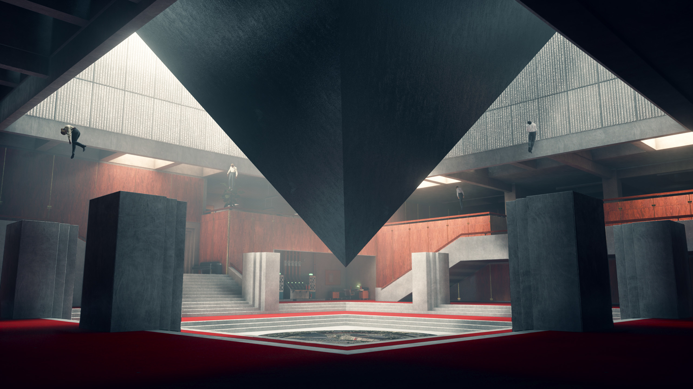
</a>

*Control's interiors use deliberate negative space — large empty volumes surrounding small human-scale objects — as a primary design tool. Empty floor communicates exposure, scale, and pacing. Negative space is a greybox decision, not a decoration decision.*

---

## 3. Spatial Grammar: Primary Paths, Zones, and Sightlines

Every interior space has a grammar — a set of spatial rules that governs how a player moves through it, what they prioritise, and in what sequence they engage with its content. Violating this grammar does not produce a more interesting space; it produces a confusing one.

### Primary and Secondary Paths

Every interior needs a **primary path** — the route a first-time player will follow by instinct — and **secondary paths** that reward active exploration. The primary path is established through three design signals operating simultaneously:

- **Light** — brighter areas pull the eye and the body forward.
- **Openness** — wider passages feel safer and invite forward movement.
- **Prop silhouette** — furniture and obstacles channel movement without explicit barriers.

Secondary paths are where you place content that rewards curiosity: clues, upgrades, risk-reward trade-offs, optional narrative details. A secondary path should be slightly darker, slightly narrower, or slightly occluded relative to the primary path — signals that tell the player this is optional but worth investigating. Secondary paths that are visually identical to the primary path produce exploration that feels arbitrary rather than rewarding.

### Sightlines as Design Decisions

A sightline is not an accident of geometry placement. Every unobstructed line between a player position and a point of interest is a design decision that should be made deliberately in the greybox. Sightlines serve three functions:

**Information gating.** The player can only see object X from position Y, which means they must navigate to Y before X becomes available. This is spatial puzzle design without scripting.

**Anticipation.** A partially visible object in the background motivates the player to move toward it. The partially revealed object is more compelling than the fully visible one.

**Spatial orientation.** A visible landmark in the distance tells the player where they are in the space and gives them a navigational goal without UI intervention.

### The Three-Depth Rule

When viewed from the entry point, a functional interior reads across three planes of depth: **foreground** (immediate entry zone, where the player orients), **mid-ground** (main activity area, where primary content lives), and **background** (destination or resolution — an exit, a focal prop, a zone the player is working toward). This three-depth structure gives the player an immediate spatial goal and a sense of the room's scale without requiring explicit navigation markers.

Avoid placing your most important interactable element at the entry point. Make the player read the space before they interact with it.

<!-- Search: "Skyrim Anniversary Edition" tavern interior screenshot | Source: bethesda.net/en/press | The Bannered Mare in Whiterun — shot from entrance showing bar, tables, and private rooms in one frame -->
<a href="./images/interior/skyrim-bannered-mare.jpg" target="_blank" rel="noopener">
  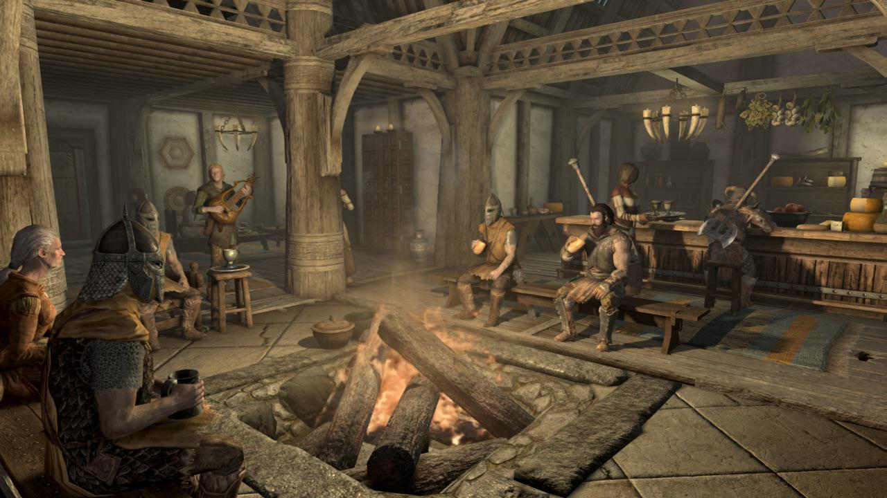
</a>

*Skyrim's Bannered Mare illustrates the three-depth rule clearly from its entrance sightline: bar at the background, tables at mid-ground, entry mat at foreground. The player reads the entire space in a single glance and immediately understands where every activity type lives.*

---

## 4. Functional Zoning: Design Spaces for Behaviour, Not Aesthetics

Functional zoning is the practice of dividing an interior space into areas defined by their **intended player behaviour**, not by their visual theme. A zone is not a room with different wallpaper. It is an area where the player does a specific thing, and every design decision in that area should support that behaviour.

### Zone Taxonomy

**Orientation Zone.** The area the player enters first. Low prop density, clear sightlines to the rest of the space, no high-priority interactables. Its job is to give the player time to build a spatial model before they are asked to act.

**Activity Zone.** The main body of the interior, where the primary gameplay behaviour occurs. Activity zones should have higher prop density than orientation zones, but readability of key elements must not be compromised by decorative clutter.

**Interaction Zone.** The immediate area around any interactable element — evidence, a management station, a pickup, a puzzle element. Interaction zones should be slightly differentiated from the surrounding activity zone through flooring, localised lighting, or a slight spatial indent. The player should be able to identify an interaction zone as a place where *something happens* before they understand what.

**Transition Zone.** Corridors, doorways, and threshold spaces. These are pacing tools, not wasted space. A transition zone between two activity zones gives the player a low-stimulus beat to process what just happened and prepare for what comes next. Keep transition zones short but do not eliminate them.

### Zone Conflicts to Avoid

The most common zoning error is placing interaction zones inside orientation zones — putting interactable elements immediately at the entry point before the player has had time to read the space. The second most common error is allowing activity zone prop density to bleed into interaction zones, making individual interactables unreadable against a busy background.

A third error is zone ambiguity: areas that serve no identifiable function, or areas that partially serve two zone types without committing to either. Every square metre of an interior should belong to a zone and serve its function.

---

## 5. Lighting Hierarchy: A Production System, Not a Visual Effect

Lighting is not a finishing step. It is a spatial design system that must be planned at the greybox stage and iterated alongside layout and zoning decisions. The question is never "what lights make this look good?" — it is "what lighting hierarchy serves the gameplay and communicates the spatial logic?"

### The Three-Level Hierarchy

Every interior should be built around a three-level lighting hierarchy:

**Ambient base** is the scene's minimum visibility level — the indirect bounce that ensures no area falls below playable darkness unless intentionally designed to be dark. In Lumen, this is managed through a low-intensity Skylight and Emissive material properties. Establish this first, at a level that makes the greybox navigable throughout.

**Zone fill** is the directional or area lighting that defines each functional zone's character. This is where colour temperature does its design work. Warm fill (2700–3200K) reads as safe, occupied, functional. Cool fill (5000–6500K) reads as institutional, tense, or abandoned. Zone fills can differentiate zones visually without requiring architectural barriers between them — colour temperature alone can signal to a player that they have crossed from one zone type into another.

**Point interest** is the highest-intensity light in a given zone, positioned to draw the eye to the most important element — an interactable prop, an exit, a narrative object. In any zone, there should be exactly one point interest light. Two equally bright lights in the same zone give the player no priority signal. This is a design failure.

### Motivated Sources

Every engine light must be **motivated** — attributable to a visible physical source within the diegetic world: a ceiling lamp, a monitor screen, a candle, a window, an emissive material surface, a gap in a structure. If a player could reasonably ask "where is this light coming from?" and have no answer, the light is unmotivated and breaks spatial credibility.

In Unreal Engine: separate the **practical** (the visible light source prop) from the **engine light** (the actual Point Light, Spot Light, or Rect Light component). The practical prop is placed for visual plausibility; the engine light is positioned near it and tuned to match its character. They are different objects with different jobs. A common implementation error is placing engine lights without practicals — scenes that are technically lit but spatially implausible. This reads immediately as unfinished.

### Lighting State Changes

For spaces where the gameplay state changes — a puzzle solved, a mission completed, a resource depleted, a zone unlocked — lighting state changes are the primary environmental feedback mechanism. A room that shifts from cool and tense to warm and resolved communicates the state change faster and more viscerally than any UI element.

Implement state-based lighting through **Blueprint timeline-driven interpolation of light intensity and colour properties**. A Timeline node driving a Lerp between two light colour and intensity values, triggered by the relevant gameplay event, is a straightforward Blueprint pattern with no architecture risk. Keep transition durations short — one to two seconds is sufficient for a gameplay-reactive state change.

<!-- Search: "Dark Souls Remastered" enemy silhouette screenshot | Source: bandainamcoent.com/press | Enemy backlit against bright archway or window — Anor Londo archer knights against exterior light is ideal -->
<a href="./images/interior/dark-souls-corridor.png" target="_blank" rel="noopener">
  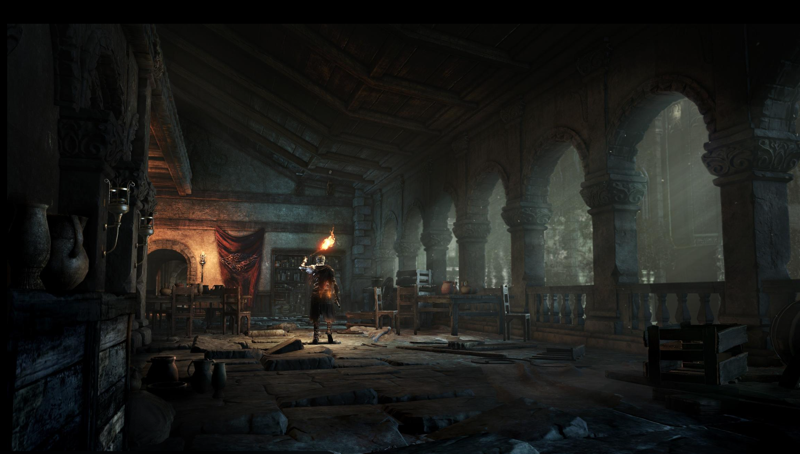
</a>

*The point interest principle applied to character readability: the subject is identifiable at range because the brightest area of the frame is directly behind it, creating immediate silhouette contrast. Apply the same logic to your interaction zones — the brightest point in any zone should be the element the player needs to find.*

---

## 6. The Hierarchy of Objects in an Interior Scene

Every object in an interior belongs to a layer of a structured hierarchy. This hierarchy is not a decorative convention — it is a production discipline that determines the order in which objects are placed, the visual weight each layer is permitted to carry, and the way in which each layer must serve the layers above it. Understanding the hierarchy is what separates a space that has been *designed* from one that has been *filled*.

Build from the outside in, and from the bottom of the hierarchy upward. Never place objects from a lower layer before the objects above them have been finalised. The most common production failure in student interiors is bottom-up placement: surfaces covered in tertiary detail before the hero prop layout has been validated. Every iteration on the hero layout then requires undoing decorating work, which in practice means the layout is never properly iterated at all.

### The Seven Layers

**Layer 0 — Architectural Shell.** Walls, floors, and ceilings. The spatial container. This layer defines room volume, occlusion boundaries, and the maximum navigable area. It is built in the greybox phase from BSP or modular kit geometry. Nothing else is placed until this layer is complete and correct at human scale. The shell must enclose volumes cleanly for Lumen to function efficiently — gaps, floating geometry, and overlapping surfaces all impose rendering cost and compromise indirect lighting quality.

**Layer 1 — Structural Features.** Doorframes, windows, archways, load-bearing columns, staircases, and built-in architectural fixtures. These break the shell into connected traversable spaces and establish the scene's primary sightlines. Every structural feature is a greybox decision: a doorframe determines what is visible from where; an archway defines a zone threshold; a column defines a navigation channel. These are never decorative elements — they are spatial constraints that determine everything placed inside them. Confirm that all structural features read correctly against the mannequin before proceeding.

**Layer 2 — Large Zone-Defining Furniture and Fixtures.** Counters, large tables, shelving units, beds, sofas, workstations — objects large enough to shape navigation flow and define what each zone is used for. These are the first layer of objects that communicate zone identity to the player. A counter tells the player "this is a service point." A cluster of chairs around a table tells the player "this is a social zone." Large furniture must be placed with navigation channels in mind: every corridor between furniture pieces should be at least 120 cm to remain navigable. Do not crowd this layer. The primary function of large furniture is spatial definition, not decoration.

**Layer 3 — Hero Props.** Gameplay-significant unique objects: an interactable item, a piece of narrative evidence, a puzzle element, a collectible, a quest-critical station. Hero props exist at this layer because they require the full spatial context of Layers 0–2 to be placed correctly. A hero prop needs clear backing geometry, deliberate lighting, and isolation from visual competitors. Its silhouette must be identifiable from its approach path, and its value contrast against its background must be sufficient to pull the eye. Keep the count to one or two per zone. More than two heroes per zone means no zone has a clear focal point.

**Layer 4 — Secondary Props.** Environmental context objects that establish plausible habitation: additional furniture, equipment, containers, decorative architectural elements, books, implements, equipment racks. These populate the zone with evidence of use and purpose without competing with hero props. A secondary prop should not silhouette strongly against its background. It should occupy mid-range values that read as environmental texture rather than as individual objects demanding attention. The relationship between secondary props and hero props is the relationship between a supporting cast and a lead — present, purposeful, subordinate.

**Layer 5 — Tertiary Props.** Small surface details: cups, papers, scattered tools, personal items, clutter that implies specific habitation by a specific character or group. These are the final compositional layer and must be placed last. A tertiary prop that silhouettes clearly against its background, or that carries higher value contrast than a nearby hero prop, is a placement failure. Tertiary props must sit in the same value range as the surfaces they occupy. Their purpose is to answer the question "who lived here?" — not to add visual interest to the scene overall.

**Layer 6 — Lighting Practicals.** Visible physical light source props: ceiling lamps, desk lights, monitors, candles, emissive surface panels, fire elements, window apertures. These are placed after the prop hierarchy is finalised because their position depends on what they need to illuminate and what narrative context the scene has established. Every engine light in the scene must be matched to a practical at this layer. A practical placed after hero positioning ensures that each light source reinforces the spatial hierarchy rather than competing with it. Adjust engine light intensity and colour temperature to match each practical's implied character — colour temperature communicates zone identity; intensity communicates spatial priority.

**Layer 7 — Particles and VFX.** Dust motes, steam, fire, emissive flickers, atmospheric haze, light shafts. Applied last, once the full visual weight of the scene is established. Particles must never be used to compensate for a weak prop hierarchy — they are enhancement, not correction. A light shaft through a dusty window amplifies an already-legible space; it cannot rescue an illegible one. Keep particle density inversely proportional to prop density. A busy zone needs almost no particle work. An empty, monumental space can carry more.

### Hierarchy Diagram

The following diagram represents the layered dependency structure of an interior scene. Each layer depends on the correctness of all layers above it. Assets at any layer should never be placed before the layers that contain them have been validated.

```mermaid
flowchart TD
    L0["<b><u>Layer 0</u></b><br>Architectural Shell (i.e. Walls, Floors, Ceilings — defines volume, occlusion, Lumen boundaries)"]
    L1["<b><u>Layer 1</u></b><br>Structural Features (i.e. Doorframes, Windows, Columns, Stairs — establishes sightlines and zone thresholds)"]
    L2["<b><u>Layer 2</u></b><br>Zone-Defining Furniture (i.e. Counters, Tables, Shelving, Beds — defines zone identity and navigation channels)"]
    L3["<b><u>Layer 3</u></b><br>Hero Props (i.e. Interactables, Evidence, Quest Objects — 1–2 per zone, high value contrast, clear silhouette)"]
    L4["<b><u>Layer 4</u></b><br>Secondary Props (i.e. Furniture context, Equipment, Containers — mid-range values, subordinate to heroes)"]
    L5["<b><u>Layer 5</u></b><br>Tertiary Props (i.e. Surface detail, Clutter, Personal items — same value range as surface, never silhouette)"]
    L6["<b><u>Layer 6</u></b><br>Lighting Practicals (i.e. Lamps, Screens, Candles, Windows — every engine light requires a motivated source)"]
    L7["<b><u>Layer 7</u></b><br>Particles and VFX (i.e. Dust, Steam, Fire, Light shafts — enhancement only, applied last)"]

    L0 --> L1 --> L2 --> L3 --> L4 --> L5 --> L6 --> L7

  style L0 fill:#9E2A2A,color:#ffffff,stroke:#C44444
    style L1 fill:#A84E2A,color:#ffffff,stroke:#C87050
    style L2 fill:#B87228,color:#ffffff,stroke:#D49040
    style L3 fill:#C49228,color:#ffffff,stroke:#E0B040
    style L4 fill:#7A9A28,color:#ffffff,stroke:#9ABE40
    style L5 fill:#4A9040,color:#ffffff,stroke:#6AB060
    style L6 fill:#2E7A3A,color:#ffffff,stroke:#489A58
    style L7 fill:#1A6830,color:#ffffff,stroke:#348850
```

### Placement Order Is Production Order

The hierarchy defines a strict placement sequence. In Unreal, this maps directly to the order in which you should work:

Begin with the architectural shell (Layer 0) built from modular kit pieces on the correct grid, fully enclosed. Confirm it is complete before adding structural features (Layer 1). Once the doorframe positions and window placements are correct, bring in large furniture (Layer 2) and confirm that navigation channels remain usable. Only then finalise hero prop positions (Layer 3) with full silhouette and lighting consideration. Secondary props (Layer 4) follow once heroes are locked. Tertiary details (Layer 5) are last in the prop pass. After all geometry and props are finalised, place practicals (Layer 6) and tune engine lights to match them. Particles and VFX (Layer 7) are the final pass — never before the lighting hierarchy is established.

Any workflow that deviates from this order — particularly any workflow that places tertiary detail before hero positions are confirmed — will produce iteration debt that compounds at every subsequent stage of production.

## 6a. Prop Readability: Silhouette, Value, and the Set Dressing Hierarchy

A player cannot interact with an object they cannot identify as significant. Readability is not a visual polish concern — it is a gameplay concern. An unreadable interactable is an inaccessible mechanic.

### Silhouette First

Shape is processed before colour, texture, or material detail. An interactive prop's silhouette — its outline against its background — is the first identification signal the player receives. Interactable props must have silhouettes that are distinct from their surroundings. This is a placement and scale decision made in the greybox, not a material decision made in the final pass.

**Silhouette test:** temporarily disable all scene lights and illuminate only with a neutral overhead directional. In this state, every prop reads as pure shape. If your key interactables are not immediately identifiable in this view, their silhouette is failing. Fix placement, scale, or backing geometry — not the material.

### Value Contrast

After silhouette, the next readability signal is **value contrast** — the difference in luminance between a prop and its immediate background. Interactive props should be distinctly lighter or darker than the surface they sit against. Mid-range values on both prop and background produce props that visually disappear.

This is a material authoring decision, not a lighting decision. Do not use lighting to compensate for poor value relationships. Establish the material value hierarchy first — background surfaces occupy mid-range; interactables are high or low value — then layer lighting on top of a readable base.

### The Set Dressing Hierarchy

Every prop in a scene should be classifiable as one of three tiers:

**Hero props** are unique, gameplay-significant objects placed with deliberate spatial intention. Keep the count low. A space with ten hero-scale objects has no heroes — it has visual noise.

**Secondary props** populate the space with plausible environmental context — furniture, equipment, containers — establishing that people used this space for a specific purpose. They should not compete visually with hero props.

**Tertiary props** are small detail objects that add life and imply specific habitation. They should sit in the same value range as the surfaces they occupy. A tertiary prop that silhouettes clearly against its background is competing with your hero props for the player's attention, which is a design failure.

**The ratio matters.** A typical interaction zone should have one to two hero props, four to eight secondary props, and a small number of tertiary details. A zone with many competing hero-scale objects and sparse secondary props produces a space that feels artificially dressed and fails readability.

---

## 7. Mechanics-Driven Layout: Space and Gameplay Are Not Separate

The most important principle in this document is the one most consistently violated: **the layout of a space must be determined by the gameplay that occurs within it, not by aesthetic preference or asset availability**.

A space designed around available assets produces a game that looks dressed but does not play. A space designed around the mechanics it must support produces a game that plays cleanly regardless of asset quality.

### Designing from the Mechanic Outward

The design process for any interior space should start with a single question: **what must the player be able to do here?** The answer determines the space's layout before any other consideration. Aesthetic decisions follow from spatial decisions, which follow from mechanic requirements.

For any interior, map the required player actions before building the geometry: navigation paths, interaction positions, camera requirements, combat encounter shapes, management station reachability. Each action implies a spatial constraint. The greybox is the sum of those constraints.

### Interaction Verb Design

Your interaction verbs imply specific spatial relationships between player and object. Design prop placement with the verb in mind.

**Examine** requires close proximity, a stable camera angle that frames the object cleanly, and isolation from surrounding prop clutter. Place examine targets at eye height with clear backing geometry and no competing props within the immediate framing zone.

**Activate** implies a visible state change that should be readable from a distance. The activated object's changed state should be visible from the widest sightline in the zone so the player always witnesses the result of their action.

**Collect** removes the prop from the scene. The prop's pre-collection position must be legible from the approach path, and the visual feedback on collection must be immediate and unambiguous.

<!-- Search: "Gears 5" cover combat interior screenshot | Source: news.xbox.com/en-us/press/ | Elevated or slightly top-down shot showing cover geometry layout -->
<a href="./images/interior/gears-of-war-cover-combat.jpg" target="_blank" rel="noopener">
  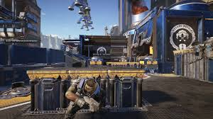
</a>

*Gears' cover placements are determined by combat requirements first, dressed aesthetically second. Every piece of cover exists because the encounter needs the player to be able to crouch there at a specific moment. Apply this logic to every zone in your interior: every spatial decision should be justifiable by reference to a mechanic.*

---

## 8. Contained Hub Design: The Architecture of Focus

A contained hub is a space designed to be revisited. Unlike a linear corridor — which the player passes through once — a hub must reward multiple visits, remain legible across revisits, and support the player's evolving understanding of the space without feeling static or exhausted.

### Legibility Across Revisits

A hub must be **instantly re-legible** — orientation after returning should take no more than one or two seconds. This requires the hub's landmark structure to be immediately identifiable from the entry point and to remain consistent between visits.

Landmark anchors can be architectural (a distinctive structural element at the hub's centre), lighting-based (a dominant warm pool marking the hub's focal point), or prop-based (a large, distinctive hero prop at the hub's centre of gravity). The anchor should be the first thing the player sees on entry and the last thing they see before exiting.

### State Communication in Hubs

Hubs in management or progression games must communicate **current state** spatially — which elements are active, which need attention, what has changed since the last visit. This communication must be achievable through environmental signals rather than relying entirely on UI overlays.

In Unreal, bind element state to **light component properties and material parameter collections**. An element that needs attention might carry a slightly brighter, warmer light and a subtle particle effect. An idle element might be cooler and darker. These signals should be readable from the hub's central position without the player approaching each element to check its state individually. Environmental state communication reduces UI dependency and increases spatial legibility simultaneously.

<!-- Search: "Skyrim" Riverwood overview screenshot | Source: bethesda.net/en/press | Slightly elevated shot showing main thoroughfare with buildings radiating from it -->
<a href="./images/interior/skyrim-riverwood.jpg" target="_blank" rel="noopener">
  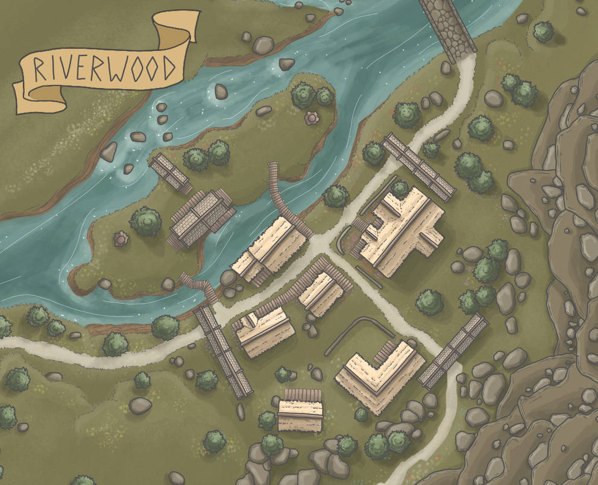
</a>

*Riverwood, used here as an exterior analogue, demonstrates hub-and-spoke circulation logic: a central thoroughfare with clearly differentiated destinations radiating from it. The player navigates by spatial memory after a single visit. The principle scales directly to interior hub design — spoke destinations must be identifiable from the hub centre without UI assistance.*

---

## 9. Modularity and the Content Pipeline

Asset packs are modular kits: collections of wall segments, floor tiles, ceiling panels, doorframes, and trim pieces designed to assemble on a grid. Using them correctly requires understanding the system.

### The Grid Contract

Every modular kit is built on a standard grid — typically 100 cm, 200 cm, or 400 cm intervals. **Enable translation snapping in Unreal and set the snap value to match the kit's grid unit before placing any modular piece.** Without snap, gaps and floating seams appear between pieces. These are extremely time-consuming to correct after the fact and they read immediately as unfinished to any reviewer.

Identify the kit's grid unit before beginning assembly. Place two wall segments side by side and confirm they meet cleanly with no gap or overlap. If they do not, the snap value is wrong.

### Mixing Kits

Using more than two asset kits in a single interior almost always produces a visually incoherent space. Each kit has its own material language — its own roughness range, value range, hue family, and scale conventions. Mixing three or four kits at equal visual weight produces rooms that read as assembled from random parts rather than inhabited spaces.

Choose one kit as your primary, supplemented by a second kit for specific prop types if needed. Use the primary kit's material properties as the authority for your own custom materials — match their value range and roughness conventions so that authored materials do not stand out as foreign objects in the scene.

### Asset Placement Sequence

Place assets in accordance with the set dressing hierarchy: hero positions first, secondary context second, tertiary detail last. Do not place tertiary props before hero positions are finalised. The most common decorating error is bottom-up placement — filling surfaces with detail before confirming that the hero prop layout is correct. This makes every subsequent layout iteration significantly more expensive.

---

## 10. Scale and Ergonomics

Incorrect scale is one of the most immediately readable errors in student interiors. It breaks spatial credibility, interferes with camera behaviour, and signals to any reviewer that the space was not tested at play-height.

### Reference Dimensions

| Element | Real dimension | Unreal (cm) |
|:---|:---|:---|
| Standard door height | 2.1 m | 210 cm |
| Standard ceiling height | 2.4–3.0 m | 240–300 cm |
| Table surface height | 0.75 m | 75 cm |
| Seat height | 0.45 m | 45 cm |
| Counter / bar height | 0.90 m | 90 cm |
| Average eye height (standing) | 1.65 m | 165 cm |
| Narrow corridor width | 1.2 m | 120 cm |
| Comfortable corridor width | 1.8–2.4 m | 180–240 cm |

The default Unreal mannequin is 180 cm tall. It is your calibration reference throughout the greybox phase. Place it beside every door frame, at every desk or counter surface, and beside every major interactive prop. If anything looks wrong relative to the mannequin, fix it before placing assets.

### The Most Common Scale Errors

Door frames scaled to four or five metres because a modular wall piece was rescaled without adjusting the frame separately. Ceilings above four metres in domestic or institutional spaces that have not been designed to be monumental. Management station counters so tall that the player character disappears behind them during interaction. All of these are greybox failures — they should be caught during the mannequin calibration pass before a single final asset is placed.

---

## 11. Environmental Storytelling: Space as Narrative Infrastructure

Environmental storytelling is the practice of embedding narrative information into the physical state of a space so that no dialogue, cutscene, or text is required for the player to understand what happened here, who was here, and what the stakes are. It is not a decorative technique — it is a systems design technique. The space is a communication medium.

### Techniques

**Evidence of past events.** Objects in states that imply a specific prior action: an overturned chair, a meal abandoned mid-bite, a shattered window with debris correctly distributed relative to the impact direction. Each implies narrative without exposition.

**Character inference through possession arrangement.** The specific arrangement of objects implies the person who occupied the space — their habits, priorities, and state of mind at the moment of departure. Use props to construct the absent character rather than to fill surfaces.

**Temporal layering.** Surfaces that communicate time through material state: rust accumulation, paint degradation, organic growth, dust deposition. A Substrate material that represents only the current clean state of a surface is not doing environmental storytelling work. A material that represents what happened to that surface over time is narrative infrastructure.

**Cause and effect chains.** A sequence of props that implies a narrative action: footprints to a displaced rug to a hidden compartment. Each element implies the next. The player reconstructs the narrative by following the physical evidence spatially.

**State contrast.** A single intact, well-maintained object in an otherwise deteriorated space communicates change more powerfully than any amount of explicit exposition. The contrast between what was and what is, expressed through object state, is one of the most efficient storytelling tools available.

### What Environmental Storytelling Is Not

It is not placing lots of props. A room full of random themed objects is set dressing without authorship. Every prop intended to communicate narrative must be placed with deliberate spatial logic. Why is this object here? What does its specific state — not just its presence, but its current condition — communicate? Could a player read its narrative role without being told?

<!-- Search: "BioShock Remastered" interior environmental storytelling screenshot | Source: 2k.com/en-US/press/ | Dentist's office, orphanage classroom, or Kashmir Restaurant opening — room where narrative reads from prop arrangement alone -->
<a href="./images/interior/bioshock-dentists-office.png" target="_blank" rel="noopener">
  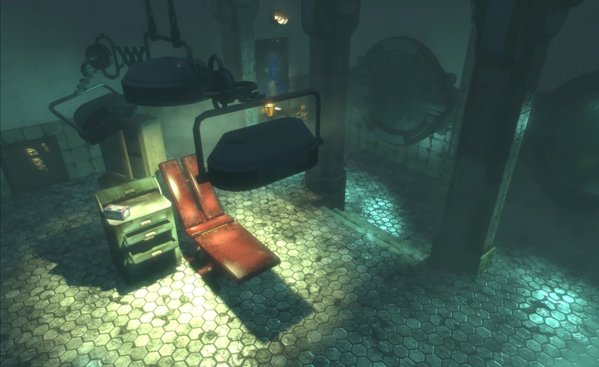
</a>

*BioShock's rooms are the benchmark: every object communicates something about who was here and what happened to them. The quality of the materials tells you what Rapture was; their current state tells you what happened to it. A player should be able to reconstruct the narrative of a scene from its physical contents before any dialogue or interface element confirms what they have read.*

---

## Quick Reference: Production Checklist

Use this at each project milestone. It is a production discipline tool, not a submission rubric.

| Principle | Check |
|:---|:---|
| **Greybox complete** | Is the space fully playable in greybox before any final assets were placed? |
| **Spatial grammar** | Does the primary path feel natural to follow without instruction? |
| **Three-depth structure** | Are foreground, mid-ground, and background zones identifiable from entry? |
| **Functional zones** | Can every area be labelled as orientation, activity, interaction, or transition? |
| **Lighting hierarchy** | Are ambient base, zone fill, and point interest layers distinct and intentional? |
| **Motivated sources** | Does every engine light have a visible practical source? |
| **Lighting state** | Do gameplay state changes trigger corresponding light state changes? |
| **Silhouette test** | Do hero props read clearly under a single overhead directional? |
| **Value contrast** | Are interactables distinctly lighter or darker than their backgrounds? |
| **Set dressing ratio** | Few heroes, moderate secondary, sparse tertiary? |
| **Grid snap** | Are all modular pieces snapped with no visible seams? |
| **Scale calibration** | Has the mannequin been used to validate door frames, ceilings, and stations? |
| **Environmental storytelling** | Can a player reconstruct the space's narrative from props alone? |
| **Mechanic fit** | Does every spatial decision support a specific gameplay behaviour? |
| **Performance** | Are occlusion boundaries clean? Is Lumen working harder than it needs to? |

---

## Reflective Questions

These questions are intended for individual reflection after a greybox review and may be used as the basis for in-class critique. Answer them with reference to your current build state, not your intended final state.

1. **Greybox discipline.** At what point did you begin placing final assets? Was your spatial layout validated in greybox first, or did you begin dressing the space before its flow was confirmed? What did you discover — or fail to discover — because of when you made that transition?

2. **Primary path.** Walk your space in play mode without prior knowledge of the intended route. Where do you go first? Is that where you intended the player to go first? If there is a discrepancy, what is causing it — lighting, prop placement, spatial openness — and what is the minimum change that would correct it?

3. **Functional zoning.** Draw a top-down diagram of your space and label every area with its zone type. Are there any areas that do not map to a zone? What is their purpose, and do they need to exist? Are any two zones bleeding into each other in ways that compromise readability?

4. **Lighting hierarchy.** List every engine light in your scene and classify each as ambient base, zone fill, or point interest. Is there exactly one point interest light per zone? Are any zones missing a fill, or over-lit with competing sources of equal intensity?

5. **Motivated sources.** For every engine light, identify the practical source that motivates it. If you cannot identify one, what visible source could you add to the space to justify the light? Is the engine light's colour temperature and intensity consistent with its practical source?

6. **Silhouette and readability.** Which of your hero props is hardest to identify from its approach path, and why? Is the problem silhouette, value contrast, backing geometry, or placement height? What is the minimum change that would fix it?

7. **Mechanic fit.** For each gameplay action that occurs in your space, identify the specific spatial decisions that support it. Is there any action that the space currently works against rather than with? What would need to change in the layout to resolve it?

8. **Environmental storytelling.** Without using any UI, dialogue, or text, what does your space communicate about who was here and what happened? Write three sentences from the perspective of a first-time player describing what they would infer from the physical contents. Does that inference match your intent?

9. **Set dressing ratio.** Count the hero, secondary, and tertiary props in your primary interaction zone. Is any tertiary prop competing visually with a hero prop? If so, which needs to change — the hero's placement, the tertiary's value, or both?

10. **Scale credibility.** Place the default mannequin at your most important interaction point. Take a screenshot. Does the scale relationship between the character, the prop, and the surrounding architecture feel correct? If not, is the problem the prop, the ceiling, or the floor area?

11. **State communication.** Describe exactly what changes in your space when the most important gameplay event occurs. How many of those changes are spatial — lighting, prop state, VFX — versus UI-only? Could a player understand that the event occurred if all UI were hidden?

12. **Production honesty.** What is the one spatial or lighting decision in your current build that you know is wrong but have not fixed yet? What is the actual reason it has not been fixed — time, difficulty, or the expectation that it will not be noticed? What is the cost of shipping it in its current state?

---

## Finding Your Environment — CA Practical Steps

> Complete these steps before we begin the next topic in this sequence. The goal is a single committed environment choice, supported by references and a sketch. Not a shortlist. A decision.

### Step 1 — List Three Real-World Interior Types

Write down three real-world interior types you find **visually interesting** — a server room, a Victorian apothecary, a flooded archive. Pick a space supported by free third-party assets. 

### Step 2 — Apply the Puzzle Filter

For each, ask: **does it support three physically separated puzzle elements?** A broom cupboard does not. A disused laboratory does. Eliminate any space that cannot plausibly contain the puzzle structure the ICA requires.

### Step 3 — Name the Three-Beat Narrative

For each surviving option, **write one sentence for each narrative beat**:

- **Confusion** — what is the starting state and what does the player not yet understand?
- **Insight** — what does examination and interaction reveal?
- **Resolution** — what does the final discovery unlock?

If you cannot answer each beat in a single sentence, the environment has no inherent story. Pick a different one.

### Step 4 — Find Three Photographic References

Find **three real-world photographic references** for your top choice — not concept art, not game screenshots. Architectural photography, interior design catalogues, historical archives. If you cannot find three strong references, the environment is too vague to build from.

### Step 5 — Sketch a Top-Down Layout

Sketch a rough top-down layout containing **at minimum four distinct areas**:

- One orientation zone
- At least two activity zones
- One transition space

Confirm that the three puzzle elements can be **physically separated** across those zones.

### Step 6 — Apply the Gut Check

Would you want to be locked in this room for five minutes? If the honest answer is no, pick a different one.

<h4>Example 1 - Decommissioned Hospital Pharmacy</h4>

> The following example demonstrates how a strong environment choice satisfies each of the six selection steps. Use it as a reference point for the quality of thinking required in your own project submission.

*Late 1970s institutional dispensary. Partially flooded ground floor. Power intermittently restored.*

A hospital dispensary/pharmacy. Narrow counter separating public and staff sides, floor-to-ceiling shelving, a locked drug cabinet, a small preparation area with a sink and weighing equipment. Visually distinctive, institutionally legible, and immediately readable as a space where specific things happened.

<a href="./images/interior/hospital-dispensary-1.jpg" target="_blank" rel="noopener">
  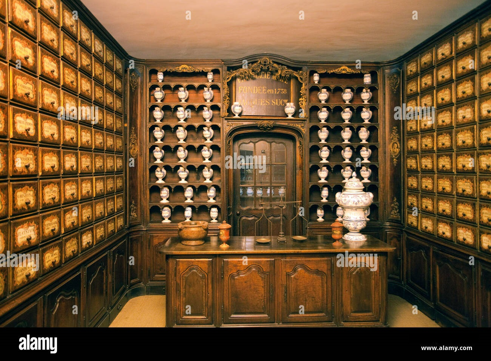
</a>

<a href="./images/interior/hospital-dispensary-3.png" target="_blank" rel="noopener">
  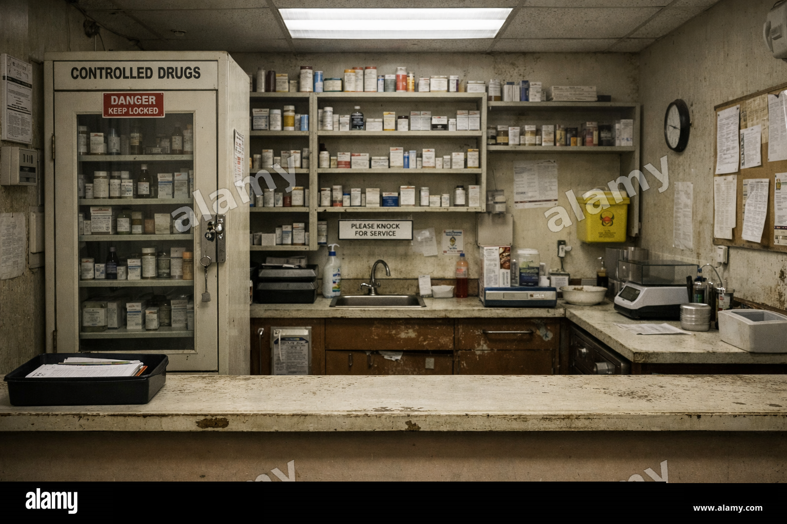
</a>

<a href="./images/interior/hospital-dispensary-2.jpg" target="_blank" rel="noopener">
  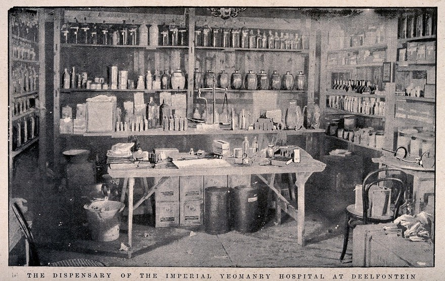
</a>

### Step 1 — Real-World Interior Type

A hospital dispensary/pharmacy. The space has a well-established real-world grammar: a public-facing counter, a restricted staff preparation area, secured storage, and institutional fittings. Every zone has a known function, which makes the environment immediately legible to a player without exposition.

### Step 2 — Puzzle Filter

Three physically separated elements are natural to the space:

- The **dispensing counter** (public front area)
- The **preparation bench** (rear staff area)
- The **locked drug cabinet** (side wall)

The player must move between all three to solve. The space supports this without contrivance — the separation is architectural, not artificial.

### Step 3 — Three-Beat Narrative

- **Confusion** — The player is locked in. The exit is a security door with an electronic lock. Power is out except for emergency lighting. Something went wrong here and no one came back.
- **Insight** — A dispensing log on the counter names a specific compound. A preparation record on the bench gives the formulation quantities. The cabinet holds the final component — but requires a combination derived from the other two.
- **Resolution** — The correct combination opens the cabinet, releasing a key card that restores power to the security door and enables escape.

### Step 4 — Photographic References

Abandoned hospital pharmacy photography is well documented. Urban exploration archives, NHS decommissioning records, and medical history collections all yield strong material. Three usable references are findable in under ten minutes. The visual language is consistent: institutional pale green or cream walls, metal shelving with glass-fronted cabinets, linoleum flooring, fluorescent strip lighting, amber prescription bottles, and printed dispensing labels.

### Step 5 — Top-Down Layout

| Zone | Location | Purpose |
|:-----|:---------|:--------|
| Orientation | Public side of counter, entrance area | Player reads the space, no immediate interactables |
| Activity Zone 1 | Behind the counter | Dispensing log — first puzzle clue |
| Activity Zone 2 | Preparation bench, rear staff area | Formulation record — second puzzle clue |
| Transition | Narrow doorway between counter and prep area | Pacing beat between zones |
| Interaction Zone | Locked drug cabinet, side wall | Final puzzle element — combination input |

Four distinct areas, clean physical separation, natural player movement through the space.

### Step 6 — Gut Check

Being locked in a derelict hospital pharmacy with intermittent lighting and no obvious exit is exactly the right level of unease for a five-minute escape room. The space has inherent tension without requiring jump scares, combat, or elaborate narrative setup.

## ICA Requirement Mapping

| ICA Requirement | How this environment satisfies it |
|:----------------|:----------------------------------|
| **Examine** | Dispensing log and formulation record — readable props with clear narrative content |
| **Collect** | Key card retrieved from cabinet on puzzle completion |
| **Modify** | Cabinet combination input; security door power restoration |
| **Custom Substrate material** | Peeling institutional paint over metal shelving; water-damaged bottle labels; rust creep on cabinet lock |
| **Niagara VFX** | Flickering fluorescent light particles; water drip effect on flooded floor area; spark burst on power restoration |
| **Camera sequence** | Security door unlock reveal — camera pulls back to show the exit becoming accessible |
| **Environmental storytelling** | Abandoned mid-task dispensing log; overturned stool; water line on shelving implying when the flooding occurred |
| **Three-depth structure** | Counter at foreground, prep bench at mid-ground, cabinet and exit at background |

